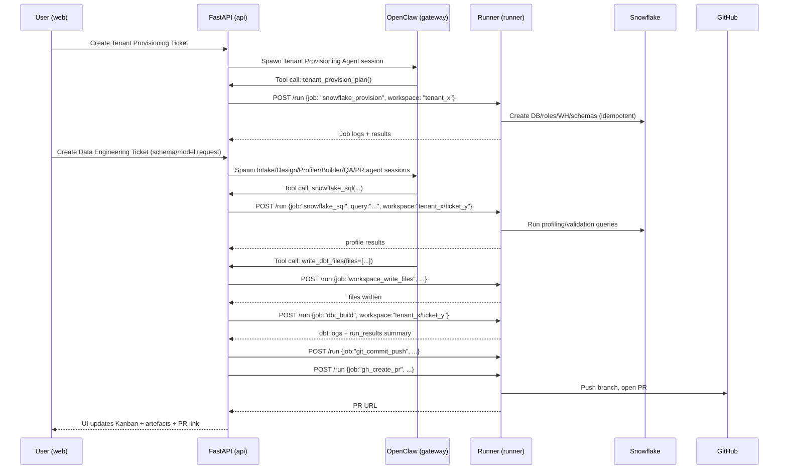
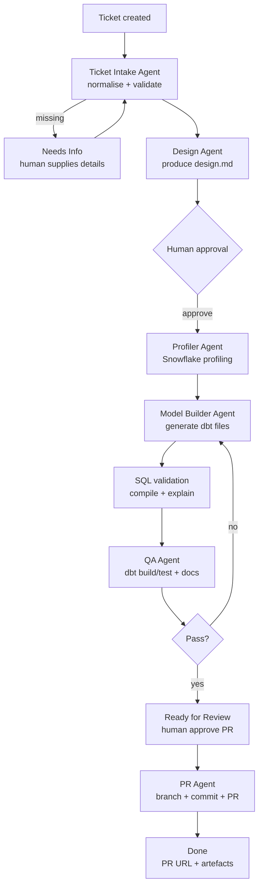

  
## Context, goals, and what this handbook improves

  

This handbook is an expanded, implementation-first, production-leaning version of the provided “Autonomous Data Engineering Hackathon Blueprint”, preserving the original ideas and architecture while making them significantly more buildable and operationally explicit. fileciteturn0file0

  

The core concepts retained from the blueprint are:

  

- A single end-to-end system that combines **Demo Tenant provisioning** and **Ticket-to-PR autonomous data modelling** into one cohesive story and codebase. fileciteturn0file0  

- A **multi-agent** workflow (intake → design → profiling → build → QA → PR) orchestrated by a FastAPI workflow engine, with explicit human checkpoints. fileciteturn0file0  

- A “mission control” UI that shows **visible agent activity**, ticket state progression, artefacts, logs, and traces. fileciteturn0file0  

- The required foundational components: Next.js UI, FastAPI orchestrator, ClawData agent framework, OpenClaw Gateway, Snowflake, dbt project, GitHub repo, SQLite for local dev state. fileciteturn0file0  

  

The key upgrade in this handbook is the **Docker “runner split” architecture**: orchestration is isolated from execution tooling (dbt, Snowflake CLI, git, GitHub CLI), which improves containment, least privilege, and auditability while making it clearer how “agents → tools → real actions” actually happens.

  

Throughout this handbook, the guiding principle is:

  

**Agents do not run shell commands. Orchestrators do not run shell commands. Only the Runner runs shell commands.**

  

## Reference architecture with trust boundaries and data flow

  

The blueprint’s architecture already establishes the essential interaction pattern: a UI drives ticket creation; an orchestrator runs a state machine; OpenClaw manages sessions and agent execution; agents produce artefacts, run dbt and warehouse queries, and finally open a PR. fileciteturn0file0

  

This handbook formalises that into a production-ready separation of concerns:

  

### Core services and responsibilities

  

- **web (Next.js, port 3000)**  

  UI only: Kanban tickets, tenant provisioning button, agent activity/graphs, artefact viewer.

  

- **api (FastAPI orchestrator)**  

  The control plane: ticket ingestion, workflow state machine, agent routing coordination, tool gateway, PR lifecycle management, event stream to UI, storage of structured state (SQLite in local dev). fileciteturn0file0

  

- **gateway (OpenClaw Gateway, port 18789)**  

  The agent runtime and session control plane (multi-agent routing, sessions, streaming). fileciteturn0file0

  

- **runner (execution container)**  

  The only place where execution tools exist and commands run: dbt, snowflake-cli, git, GitHub CLI, SQL validation, “model generation validation”.  

  Exposes a small **internal Job API** that the orchestrator can call.

  

### Container-level trust boundaries

  

Think in terms of “what would be dangerous if compromised”:

  

- **web**: untrusted, internet-facing in most deployments.

- **api**: trusted control plane; should be minimal; must not contain toolchains that enable arbitrary code execution against Snowflake or GitHub.

- **gateway**: session runtime; should not have Snowflake/GitHub credentials; should only be allowed to call orchestrator tools.

- **runner**: high-privilege execution boundary; has credentials; should have strict allowlisted job API only accessible internally.

  

### Container and network diagram

  

```mermaid

flowchart LR

  subgraph Public[Public / Ingress]

    WEB[web\nNext.js\n:3000]

  end

  

  subgraph Internal[Internal Docker network]

    API[api\nFastAPI orchestrator\n(no cli tools)]

    GW[gateway\nOpenClaw Gateway\n:18789]

    RUN[runner\nExecution container\n(db t / snow / git / gh)]

    DB[(SQLite volume\nlocal dev)]

    WS[(workspaces volume\nartefacts + logs)]

  end

  

  WEB -->|HTTPS/WS| API

  API --> DB

  API -->|agent calls + tools| GW

  GW -->|tool invoke| API

  API -->|POST /run| RUN

  RUN <--> WS

  API -->|read-only artefacts| WS

```

  

This preserves the blueprint’s shape (UI → orchestrator → gateway → agents → tools → Snowflake/dbt/GitHub), but makes the last step explicit and isolated: all “real work” occurs via the Runner. fileciteturn0file0

  

### End-to-end data flow story

  

The blueprint’s lifecycle is retained and expanded below into a fully traceable operational path:

  



  

## Docker runner-split architecture and docker-compose baseline

  

This section is the “Day 0 infrastructure” you can actually build first.

  

### Why the runner split matters

  

The runner split is worth doing even for a PoC because it enforces three properties that are otherwise easy to lose:

  

- **Containment**: only Runner can execute dbt/snow/git/gh, so “shell execution” is confined to one container with explicit ingress.

- **Least privilege**: api and gateway do not need Snowflake or GitHub tokens at all.

- **Auditable execution**: every action becomes a job request with a job ID, logs, and an output payload.

  

It also keeps the orchestrator honest: if you can’t do the demo without `subprocess.run()` inside api, you haven’t really implemented tool isolation.

  

### Internal networking model

  

Define at least two networks:

  

- `public`: only for web ingress (and optionally api for local dev).

- `internal`: `internal: true` so containers can talk to each other but the network is not reachable externally.

  

Runner should never publish ports to the host; it should only `expose` an internal port.

  

### Volumes and artefact strategy

  

You need a predictable location for artefacts and logs generated by jobs, and the UI needs to read them.

  

Recommended volumes:

  

- `state`: persistent SQLite (dev), workflow state, event log snapshots.

- `workspaces`: shared artefacts/logs directory mounted:

  - **read-write** in runner

  - **read-only** in api

  

This supports the runner split: api can display artefacts but can’t modify execution outcomes.

  

### Sample docker-compose

  

This compose file is intentionally explicit about security flags. You will tune it for your environment and base images.

  

```yaml

version: "3.9"

  

networks:

  public: {}

  internal:

    internal: true

  

volumes:

  state: {}

  workspaces: {}

  gateway_state: {}

  

secrets:

  snowflake_private_key:

    file: ./secrets/snowflake_rsa_key.p8

  github_token:

    file: ./secrets/github_token.txt

  

services:

  web:

    build: ./web

    ports:

      - "3000:3000"

    environment:

      - NEXT_PUBLIC_API_BASE_URL=http://localhost:8000

    depends_on:

      - api

    networks: [public, internal]

    user: "10001:10001"

    read_only: true

    cap_drop: ["ALL"]

    security_opt:

      - no-new-privileges:true

    tmpfs:

      - /tmp

  

  api:

    build: ./api

    ports:

      - "8000:8000"  # dev only; remove in prod behind reverse proxy

    environment:

      - DATABASE_URL=sqlite:////var/lib/autode/state/app.db

      - OPENCLAW_GATEWAY_URL=http://gateway:18789

      - RUNNER_URL=http://runner:9000

      - RUNNER_AUTH_TOKEN_FILE=/run/secrets/runner_auth_token

    volumes:

      - state:/var/lib/autode/state

      - workspaces:/workspaces:ro

    networks: [internal, public] # dev convenience; in prod keep internal only

    depends_on:

      - gateway

      - runner

    user: "10001:10001"

    read_only: true

    cap_drop: ["ALL"]

    security_opt:

      - no-new-privileges:true

    tmpfs:

      - /tmp

  

  gateway:

    build: ./gateway

    ports:

      - "18789:18789"  # dev; in prod keep internal only unless needed

    environment:

      - OPENCLAW_STATE_DIR=/var/lib/openclaw

      - OPENCLAW_TOOL_BASE_URL=http://api:8000  # tool calls routed to api

    volumes:

      - gateway_state:/var/lib/openclaw

    networks: [internal]

    user: "10001:10001"

    read_only: true

    cap_drop: ["ALL"]

    security_opt:

      - no-new-privileges:true

    tmpfs:

      - /tmp

  

  runner:

    build: ./runner

    expose:

      - "9000"

    environment:

      - WORKSPACES_ROOT=/workspaces

      - GIT_AUTHOR_NAME=autode-bot

      - GIT_AUTHOR_EMAIL=autode-bot@example.com

      - SNOWFLAKE_PRIVATE_KEY_FILE=/run/secrets/snowflake_private_key

      - GITHUB_TOKEN_FILE=/run/secrets/github_token

      - RUNNER_AUTH_TOKEN_FILE=/run/secrets/runner_auth_token

    secrets:

      - snowflake_private_key

      - github_token

    volumes:

      - workspaces:/workspaces:rw

    networks: [internal]

    user: "10002:10002"

    read_only: true

    cap_drop: ["ALL"]

    security_opt:

      - no-new-privileges:true

    tmpfs:

      - /tmp

      - /var/tmp

```

  

**Notes for production adaptation:**

- Put web+api behind a reverse proxy and remove direct host port publishing for api and gateway.

- Replace SQLite with Postgres for multi-user, multi-run concurrency; keep SQLite for local dev as requested.

  

### Runner job API contract

  

Runner must be deterministic and constrained. Avoid “run arbitrary shell” endpoints. The allowlist is your security boundary.

  

Minimum endpoints:

  

- `POST /run` → enqueue a job and return `job_id`

- `GET /jobs/{job_id}` → status (`queued|running|succeeded|failed`) + summary

- `GET /jobs/{job_id}/logs` → stream logs (SSE) for live UI theatre

  

Example request (aligning with your requirement):

  

```json

POST /run

{

  "job": "dbt_build",

  "workspace": "tenant_x/ticket_001",

  "args": {

    "target": "tenant_x",

    "select": "fct_daily_orders+",

    "vars": {"tenant_id": "tenant_x"}

  }

}

```

  

Example Snowflake SQL:

  

```json

POST /run

{

  "job": "snowflake_sql",

  "workspace": "tenant_x/ticket_001",

  "args": {

    "connection": "tenant_x",

    "query": "select count(*) from RAW.ORDERS"

  }

}

```

  

**Critical guardrails Runner must apply:**

- `workspace` must resolve under `WORKSPACES_ROOT` (no `..` traversal).

- `job` must be a strict enum allowlist.

- Each job type must validate its args schema.

- Jobs must have timeouts and maximum log sizes.

- Every job must emit structured outputs and a stable exit code contract (success/failure).

  

## Security hardening and secrets management

  

This section fills the DevSecOps gaps that hackathon outlines usually omit, without changing the conceptual architecture.

  

### Container hardening baseline

  

Apply these controls consistently:

  

- **Non-root users** for all containers.

- **Read-only root filesystems** wherever possible.

- **Drop Linux capabilities** (`cap_drop: [ALL]`).

- **No new privileges** (`no-new-privileges:true`).

- **No Docker socket mounting** (never mount `/var/run/docker.sock`).

- **Restrict writable locations** with:

  - `tmpfs` for `/tmp`

  - dedicated volumes for `workspaces` and `state`

- **Network segmentation**: Runner only on internal, not exposed.

  

Runner still needs to write artefacts. The safe pattern is “read-only image + writable workspace volume”.

  

### Credential scoping and least-privilege

  

#### Snowflake credentials

  

Use a dedicated service identity for this system:

  

- A role that can:

  - read source schemas (RAW)

  - create/replace models in an “analytics” schema (e.g. `ANALYTICS`)

  - run validation queries (`SELECT`, `EXPLAIN`)

  - optionally create tenant database objects if provisioning is part of the workflow

  

Avoid giving the orchestrator any Snowflake credential. Only Runner holds Snowflake auth material.

  

#### GitHub token

  

Use a dedicated bot token with minimal scopes required for:

  

- pushing branches to the dbt repo

- creating pull requests

  

Prefer repository-scoped tokens (or GitHub App auth) in production; for dev/hackathon, a fine-scoped PAT is acceptable.

  

### Secrets management pattern

  

Implement three tiers:

  

- **Local dev (fastest)**: `.env` + local files under `./secrets/` (gitignored).  

- **Docker Compose baseline**: `secrets:` mounted to `/run/secrets/*`.

- **Production**: external secret manager (Vault/KMS/Cloud secret store) injected at runtime.

  

A simple and reliable approach is `*_FILE` environment variables (Runner reads secrets from mounted files) which keeps them out of `docker inspect` output in many setups.

  

### Runner API authentication

  

Even on an internal network, require a shared secret for api → runner calls:

  

- Orchestrator sends `Authorization: Bearer <token>`

- Runner validates token before accepting jobs

  

This prevents lateral movement from any compromised internal container.

  

### OpenClaw tool restrictions and multi-agent isolation

  

The blueprint already emphasises per-agent tool allow/deny and sandboxing to enforce believable specialisation boundaries. fileciteturn0file0  

Use that to align “who can do what”:

  

- Profiler agent: can call `snowflake_sql` and `validate_schema`, cannot call git or PR tools.

- Builder agent: can call `write_dbt_files` and `dbt_compile`, cannot open PRs.

- PR agent: can call git/PR tools, cannot access Snowflake.

  

Treat tool allowlisting as a security and demo clarity feature: it gives judges a concrete reason your system is safe and thoughtfully designed.

  

## Agent tooling architecture and workflow engine design

  

This section clarifies the “agents interact with tools” question end-to-end, aligning with the blueprint’s multi-agent model and state machine. fileciteturn0file0

  

### The tool invocation chain

  

The canonical chain should be:

  

**Agent (OpenClaw session)** → **OpenClaw Gateway tool call** → **api tool endpoint** → **runner job API** → **execution + logs + artefacts** → **api event stream** → **web UI**

  

Agents never call Runner directly. Runner never calls OpenClaw directly.

  

### Tool catalogue (the minimum set)

  

Define tools as strongly typed functions with strict schemas. Tools are implemented in the **api** service and delegate execution to Runner.

  

Recommended tool list:

  

- `ticket_get(ticket_id)`  

  Returns structured ticket + current state + artefact links.

  

- `tenant_get(tenant_id)`  

  Returns tenant config, Snowflake connection alias, dbt target, repo info.

  

- `snowflake_sql(tenant_id, query)`  

  Delegates to runner `snowflake_sql`.

  

- `validate_schema(tenant_id, models)`  

  Delegates to runner jobs:

  - `dbt_compile` (ensures SQL compiles)

  - optional `snowflake_explain` per model

  

- `dbt_generate_model(ticket_id, spec)`  

  Pure generation + validation orchestration:

  - api renders templates (or accepts agent-produced SQL)

  - api calls runner `workspace_write_files`

  

- `dbt_build(ticket_id, select)`  

  Delegates to runner `dbt_build`.

  

- `create_pull_request(ticket_id, title, body)`  

  Delegates to runner jobs:

  - `git_commit_push`

  - `gh_create_pr`

  

- `publish_artifact(ticket_id, kind, content_ref)`  

  Registers artefacts for UI (design doc, profiler report, QA report).

  

### Standardised artefact contracts

  

To keep the UI coherent, every agent should write outputs in standard formats:

  

- **Design doc**: Markdown

- **Profiler report**: JSON + Markdown summary

- **Generated dbt files**: file list with checksums + paths

- **QA report**: JSON (machine) + Markdown (human)

- **PR summary**: Markdown + PR URL

  

The orchestrator stores metadata in SQLite, while files live in workspaces. This mirrors the blueprint’s “artefact channel + telemetry channel” approach. fileciteturn0file0

  

### Workflow state machine (operationalised)

  

Retain the blueprint’s states and extend them with operational semantics so an engineer can implement transitions safely. fileciteturn0file0

  

Suggested states:

  

- `TENANT_CREATION_REQUESTED`

- `TENANT_PROVISIONING_RUNNING`

- `TENANT_READY`

- `TICKET_INTAKE`

- `NEEDS_INFO`

- `DESIGN_REVIEW`

- `PROFILING`

- `BUILD`

- `QA`

- `READY_FOR_REVIEW`

- `DONE`

- `FAILED` (terminal but recoverable via retry)

  

For each state, define:

  

- **Entry actions** (what gets spawned)

- **Exit conditions** (what evidence must be present)

- **Retry policy** (may retry, must not retry)

- **Human approvals** (UI action required)

  

Example: `DESIGN_REVIEW`

  

- Entry: Design Agent runs and produces `design.md`

- Exit condition: `design.md` exists + orchestrator has `design_summary_json`

- Human approval: “Approve design” button required to transition → `PROFILING`

  

### Idempotency and replay safety

  

Make every job and state transition idempotent:

  

- Every job execution request includes `request_id` (UUID).

- Runner persists a job record and returns the same result if the same `request_id` is replayed.

- Orchestrator transitions should be “compare-and-swap” updates: only move from expected state.

  

This matters for live demos (recover instantly) and for production (avoid double PR creation).

  

## Request-to-PR lifecycle with concrete steps and diagrams

  

This section is the “clarified end-to-end data flow” requirement, expanded beyond the blueprint narrative. fileciteturn0file0

  

### Tenant provisioning ticket lifecycle

  

**Input:** Tenant provisioning ticket (UI form)

  

Recommended schema:

  

- tenant_id (slug)

- preset (demo flavour)

- snowflake_account_alias

- dbt_repo_url

- created_by

- requested_at

  

**Steps:**

  

1. **Persist ticket** in SQLite (`tenants`, `provisioning_runs`).

2. **Spawn Tenant Provisioning Agent** (OpenClaw session).

3. **Agent produces a provisioning plan** (DDL list + expected outputs).

4. **Orchestrator executes provisioning jobs via Runner**, e.g.:

   - `snowflake_provision` (creates database, schemas, role, warehouse)

   - `snowflake_seed_demo_data` (loads demo dataset)

   - `dbt_bootstrap` (clones repo, writes profiles/targets for tenant)

   - `dbt_build_smoke` (build a known small model)

5. **Mark tenant ready** with a tenant report artefact (UI displays status + links).

  

### Data engineering ticket-to-PR lifecycle

  

**Input:** Data engineering ticket (structured intake)

  

Recommended schema (building on the blueprint’s strict template): fileciteturn0file0  

- title

- tenant_id

- sources (db/schema/table)

- requested_outputs (models, metrics)

- constraints (incremental, late arriving window)

- acceptance criteria

  

**Detailed lifecycle:**

  



  

### SQL validation workflow (practical)

  

A robust “compile then validate” loop:

  

1. **dbt compile** in Runner for the selection set.

2. Extract compiled SQL (from `target/compiled/...`).

3. For each new/changed model:

   - run `EXPLAIN` in Snowflake to validate syntax and referenced objects.

4. Only proceed to `dbt build` after compile + explain pass.

  

This reduces wasted time and provides great demo artefacts: you can show “validated in Snowflake” before the build.

  

### Git + PR creation flow (practical)

  

Runner should implement:

  

1. Clone repo (or fetch if cached).

2. Create a branch name derived from ticket, e.g. `autode/ticket-001-fct-daily-orders`.

3. Write files into repo workspace.

4. Run formatting/lint checks (optional, time permitting).

5. Commit with a templated message including ticket ID.

6. Push branch with bot credentials.

7. Create PR using GitHub CLI or API.

8. Return PR URL and a small summary (files changed, tests run, results).

  

Store PR URL in ticket record and display it in UI.

  

## UI, workspace layout, and artefact movement between services

  

The blueprint calls for a Kanban-driven workflow plus visible multi-agent “theatre” (agent collaboration view, interaction graph, logs, traces, document viewer). fileciteturn0file0  

This section makes that implementable given the runner split (api must not write workspaces directly).

  

### Workspace and artefact directory structure

  

Use a single `WORKSPACES_ROOT` mounted into Runner and read-only into api.

  

Recommended structure:

  

```text

workspaces/

  tenants/

    tenant_retail_001/

      tenant.json

      snowflake/

        provisioning.sql

        provisioning.log

      dbt/

        repo/                      # clone/worktree for this tenant

        profiles.yml               # generated or mounted secret reference

      tickets/

        ticket_0001/

          ticket.json

          docs/

            intake_summary.md

            design.md

            profiling.md

            qa_report.md

            pr_summary.md

          dbt_changes/

            models/

              bronze/

              silver/

              gold/

              semantic/

            tests/

              schema.yml

          logs/

            profiler.log

            dbt_compile.log

            dbt_build.log

            git.log

          outputs/

            profile_report.json

            run_results.json

            docs_site/             # output of dbt docs generate --static

```

  

**How artefacts move:**

  

- Runner writes artefacts to workspace.

- api reads artefacts (read-only mount) and registers metadata in SQLite.

- web requests artefact metadata from api and displays contents.

  

For large artefacts (docs site), api can either serve static files from the workspace path (read-only) or copy to an object store in production.

  

### UI inspiration points

  

image_group{"layout":"carousel","aspect_ratio":"16:9","query":["Kanban board dashboard UI example","React Flow agent graph example","distributed tracing waterfall UI example"],"num_per_query":1}

  

### Real-time agent activity and progress reporting

  

Implement an event bus inside api:

  

- Every workflow step emits `WorkflowEvent` rows into SQLite (append-only).

- api broadcasts events over WebSockets to the UI.

- UI renders:

  - Kanban column movement

  - per-agent run list

  - live log tail (from Runner job logs via api proxy)

  - a graph view (nodes = agents/artefacts, edges = handoffs)

  

This directly realises the blueprint’s “structured events streamed to UI and captured in traces” design. fileciteturn0file0

  

## Developer onboarding and local setup guide

  

This section is written as the “clone and run” path an engineer can follow.

  

### Prerequisites

  

- Docker Desktop / Docker Engine + Compose

- Git

- A Snowflake account (or a shared demo account) with ability to create DB/schema/role/warehouse for provisioning flows

- A GitHub repo containing a dbt project (or starter dbt project)

- Optional (recommended): a dedicated GitHub bot identity

  

### Repository layout (recommended)

  

At repo root:

  

```text

/web        # Next.js UI

/api        # FastAPI orchestrator + tool endpoints

/gateway    # OpenClaw gateway container config

/runner     # Runner job API service + execution toolchain

/infra      # docker-compose, env examples

/secrets    # local dev only (gitignored)

```

  

### Local dev secrets setup

  

Create `./secrets/` (ensure it is gitignored):

  

- `snowflake_rsa_key.p8` (or token/password file if using another auth method)

- `github_token.txt`

- `runner_auth_token` (random long secret)

  

Create `.env` at repo root (dev only), with:

  

- `DATABASE_URL` (SQLite)

- `OPENCLAW_GATEWAY_URL` (http://gateway:18789)

- `RUNNER_URL` (http://runner:9000)

  

### Start the system

  

From repo root:

  

```bash

docker compose up --build

```

  

Verify:

  

- UI: http://localhost:3000

- API (dev): http://localhost:8000

- Gateway (dev): http://localhost:18789

  

### First-run smoke test

  

1. In UI, create a tenant provisioning ticket for `tenant_retail_001`.

2. Watch:

   - tenant enters provisioning states

   - logs appear in the ticket drawer

   - tenant flips to Ready

3. Create a modelling ticket:

   - “Create fct_daily_orders (grain day) using RAW.ORDERS and RAW.CUSTOMERS”

4. Observe:

   - ticket moves through Intake → Design Review (pause)

   - approve Design Review

   - profiling runs (queries shown)

   - model files generated

   - validation + dbt build logs show progress

   - ticket moves to Ready for Review (pause)

   - approve PR creation

   - PR link appears; open it on GitHub

  

This is the same demo narrative described in the blueprint, now implemented with the runner split. fileciteturn0file0

  

## Observability, failure handling, and an implementation roadmap

  

The blueprint calls for OpenTelemetry/trace-driven “agent theatre”, event streaming, and trace UI integration. fileciteturn0file0  

This section makes observability implementable in a runner-split world.

  

### Structured logging

  

Use structured JSON logs everywhere:

  

- api logs: request_id, ticket_id, state, tool_name, runner_job_id

- runner logs: job_id, job_type, workspace, command, exit_code

  

Store logs both:

- as container logs (stdout/stderr)

- as workspace files for per-ticket inspection

  

### Tracing model

  

Even without a full distributed tracing backend, implement a consistent trace model:

  

- One “trace” per ticket run (workflow instance)

- One “span” per agent step

- Sub-spans per runner job (dbt build, snowflake sql, git push)

  

If you later add OpenTelemetry export, the spans map naturally onto a trace UI (and match the blueprint’s intended demo effect). fileciteturn0file0

  

### Failure handling and retries

  

Define explicit failure modes and recoveries:

  

- **Snowflake provisioning fails** → mark tenant provisioning run as failed; allow “retry provisioning” button (replays idempotent DDL).

- **Profiling query fails** → ticket goes to `NEEDS_INFO` or `FAILED` depending on error (missing table vs transient).

- **dbt build fails** → ticket loops back to `BUILD` with attached failure artefact and LLM-guided fix suggestion.

- **PR creation fails** → ticket remains `READY_FOR_REVIEW` with error report; human can retry PR.

  

Always preserve artefacts: even failures are demo-worthy if the UI cleanly shows them.

  

### Phased implementation roadmap

  

A practical build order that matches the required improvements:

  

**Phase one: Base Docker runner-split infrastructure**  

- Bring up web/api/gateway/runner with internal networking and shared workspaces.

- Implement Runner `/run`, `/jobs/{id}`, `/logs` with at least a “hello job” that writes a log file.

  

**Phase two: Ticket storage and workflow state machine**  

- SQLite schema: tenants, tickets, workflow_runs, events.

- WebSockets event stream + Kanban UI.

  

**Phase three: Tool gateway in api**  

- Implement tool endpoints (snowflake_sql, dbt_build, workspace_write_files) that simply proxy to Runner jobs.

  

**Phase four: Agent orchestration via OpenClaw Gateway**  

- Configure OpenClaw to call api tools.

- Implement the multi-agent pipeline (Intake → Design → Profiler → Builder → QA → PR) as orchestrator-controlled sessions, as described in the blueprint. fileciteturn0file0

  

**Phase five: Snowflake and dbt automation**  

- Tenant provisioning jobs (DDL + seed).

- Profiling SQL pack.

- dbt compile/build/test/docs jobs.

  

**Phase six: GitHub automation**  

- repo clone/worktree strategy

- branch naming conventions

- PR creation

- PR metadata attachment to ticket

  

**Phase seven: Security hardening pass**  

- non-root, RO filesystem, cap drop, internal networks

- secrets via Docker secrets

- runner auth token

  

**Phase eight: Observability and production readiness**  

- structured logs + artefact retention

- trace model + optional OpenTelemetry export

- operational runbooks: backup, rotate secrets, clean workspaces, incident handling

  

This roadmap preserves the original architecture and flow while making the runner split and production-readiness requirements first-class. fileciteturn0file0

  
**