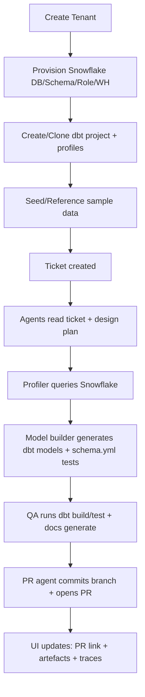
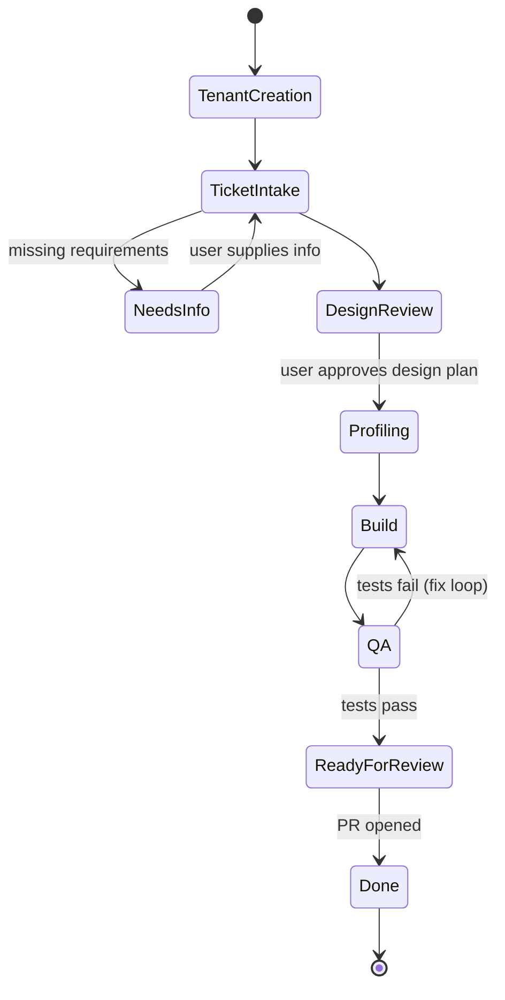

# Autonomous Data Engineering Hackathon Blueprint

*See Platform Handbook for implementation details*
C:\Users\PaulRussell\Documents\Obsidian Vault\General\Hackathon\Autonomous Data Engineering Platform Handbook with Runner-Split Docker Architecture.md

## Unified project concept and live demo narrative

This hackathon Proof of Concept is a single cohesive “autonomous data engineering platform” that fuses two ideas into one continuous, demo-friendly story:

**Demo Tenant-in-a-Box Provisioner** → instantly creates a complete analytics sandbox (warehouse + sample data + dbt project + starter dashboards) for a new “tenant”.

**Ticket-to-PR Data Modelling Autopilot** → turns a data engineering ticket into a working dbt change set (models + tests + docs), validates it, and opens a pull request automatically.

The unification matters because most “AI-for-data” demos either (a) generate code without a real environment and QA, or (b) show a nice environment with no autonomous engineering loop. By chaining provisioning → ticket → agents → PR, you demonstrate the full lifecycle that data teams actually care about: rapid environment spin-up, structured intake, repeatable modelling patterns, quality gates, and a code review workflow.

ClawData already positions itself as “an easy-to-use dashboard and FastAPI backend for managing OpenClaw agents built for data teams,” explicitly calling out: querying warehouses, generating dbt models, reviewing SQL, and more, from a UI. hat makes it an ideal foundation for the hackathon objective: build an impressive “mission control” layer for autonomous data engineering with visible agent activity and artefacts.

**End-to-end demo storyline (judge-friendly):**

A judge watches you do four things, each producing immediate visible output:

**Generate Demo Tenant** → UI shows a new tenant card; backend runs Snowflake setup and seeds data; dbt project is initialised and “hello pipeline” runs. citeturn24view0turn15view0turn31view0turn30search5

**Create ticket** → a Kanban card appears in “Ticket Intake” with a crisp, structured request template (source tables, grain, desired dimensions/measures, acceptance criteria).

**Agents autonomously execute** → Kanban card moves across states; an agent collaboration view shows messages, tool calls, and artefacts being created (profiling queries, generated SQL/YAML, dbt run/test outputs). OpenClaw supports multi-agent setups with per-agent workspaces and tool restrictions (so you can make each agent feel “real” and specialised). citeturn23search0turn27search4turn23search12turn23search5

**PR is opened** → the UI shows a fresh PR link, a diff preview, CI/QC status, and updated documentation (dbt docs artefacts). citeturn26search3turn26search21turn30search0


## Reference architecture and dataflow

### Core architectural decision

Use **ClawData as the base repo and runtime** and extend it with two big features:

**Tenant Provisioning module** (FastAPI + UI) and **Ticket-to-PR Autopilot module** (FastAPI workflow engine + UI + agent telemetry).

This aligns with ClawData’s existing shape: a FastAPI backend, a Next.js frontend, and direct integration with an OpenClaw Gateway. citeturn11view0turn24view0

### Required components mapped to concrete runtime

You requested these specific elements; below is how they land in the running system:

- **OpenClaw gateway**: runs alongside / inside the ClawData backend container (ClawData docker-compose exposes port `18789` for the gateway). citeturn24view0turn27search22turn23search21  
- **ClawData backend**: FastAPI service (port `8000`). citeturn11view0turn24view0  
- **Next.js UI**: ClawData web service (port `3000`). citeturn11view0turn24view0  
- **Snowflake demo environment**: per-tenant database/role/warehouse + datasets (seeded or referenced). Use Snowflake’s sample datasets (`SNOWFLAKE_SAMPLE_DATA`) and/or your own base DB for cloning. citeturn26search1turn26search5turn26search0  
- **dbt project**: a separate Git repo (recommended) so the PR is real and visible. dbt docs/test/build executed by agents. citeturn30search16turn30search0turn30search1  
- **GitHub repo for PR creation**: use the GitHub PR endpoints (or `gh pr create`) for a dramatic “PR appears live” moment. citeturn26search3turn26search21  
- **Ticket database**: extend ClawData’s existing SQLite persistence (docker-compose calls out SQLite persistence). citeturn24view0turn25view0  
- **Agent orchestration engine**: implement a lightweight workflow runner inside FastAPI (async worker loop + persisted workflow state + event log), using the OpenClaw Gateway for agent execution. OpenClaw is designed around an always-on Gateway owning sessions and control plane. citeturn27search22turn27search5turn27search2  

### System architecture diagram

```mermaid
flowchart LR
  UI[Next.js UI\n(ClawData web)] -->|REST/WS| API[FastAPI Backend\n(ClawData app + extensions)]
  API --> DB[(SQLite\nclawdata.db)]
  API --> OCLAW[OpenClaw Gateway\nWS + HTTP\n:18789]
  OCLAW -->|tools + skills| AGENTS[Agents\nTenant + Ticket + Build + QA]
  AGENTS -->|snow sql| SF[Snowflake Account\nTenant DB/WH/Roles]
  AGENTS -->|git + PR| GH[Git repo hosting]
  AGENTS -->|dbt CLI| DBT[dbt Project Workspace]
  API --> OTEL[OpenTelemetry Collector]
  OTEL --> JAEGER[Trace UI]
```

ClawData’s own docker-compose makes it explicit that the FastAPI service publishes both `8000` (FastAPI) and `18789` (OpenClaw gateway), and persists SQLite data and agent workspaces as volumes. citeturn24view0turn11view0 OpenClaw’s Gateway runbook describes a single multiplexed port for WebSocket control/RPC, OpenAI-compatible HTTP APIs, and “tools invoke”. citeturn27search22turn23search1turn23search12

### Dataflow diagram



Snowflake provides sample datasets via `SNOWFLAKE_SAMPLE_DATA`, and the docs highlight that it is read-only, which is why the blueprint below either references it via views or clones/loads data into a writable tenant DB. citeturn26search1turn26search5 dbt’s docs explain that `dbt docs generate` produces artefacts like `manifest.json` and `catalog.json` for a documentation site, which you can surface in your UI. citeturn30search0

### Agent orchestration diagram

```mermaid
sequenceDiagram
  participant U as User (UI)
  participant API as FastAPI Orchestrator
  participant GW as OpenClaw Gateway
  participant A1 as Intake Agent
  participant A2 as Profiler Agent
  participant A3 as Model Builder Agent
  participant A4 as QA Agent
  participant A5 as PR Agent

  U->>API: Create Ticket
  API->>GW: Start/route sessions per agent + ticket
  API->>A1: "Summarise ticket; ask missing info"
  A1-->>API: Ticket brief + clarifying questions
  API->>U: Needs Info? (HITL)
  U-->>API: Approve / provide inputs
  API->>A2: "Profile source tables"
  A2-->>API: Profile report + constraints
  API->>A3: "Generate dbt models + tests"
  A3-->>API: Files + schema.yml + docs snippets
  API->>A4: "Run dbt build/test + docs generate"
  A4-->>API: QA report + artefacts
  API->>A5: "Commit branch + open PR"
  A5-->>API: PR URL + summary
  API-->>U: Update Kanban + graphs + logs
```

OpenClaw provides session-level tools (`sessions_list`, `sessions_history`, `sessions_send`, `sessions_spawn`) explicitly to support controlled session management and “send to another session” patterns, which is a natural fit for multi-agent orchestration. citeturn27search4turn23search0

## How OpenClaw powers agentic orchestration

### What OpenClaw contributes in this project

OpenClaw is not “just an LLM call.” Architecturally, it’s an always-on gateway that owns sessions, routing, and the control plane. This is precisely what you want for a live demo where multiple agents appear to be concurrently “working” and producing artefacts. citeturn23search21turn27search22turn27search5

Concretely, this blueprint uses OpenClaw for:

**Agent routing and identity**  
OpenClaw’s channel routing rules pick one agent per inbound message, using bindings and fallbacks to a default agent. Even if your demo UI is the primary surface, you can still use this routing model internally by giving each agent a distinct `agentId`/workspace.

**Multi-agent isolation and “specialisation theatre”**  
OpenClaw supports per-agent sandboxes and per-agent tool allow/deny lists (v2026.1.6+ in docs), enabling you to demonstrate clear boundaries: e.g., the Profiler agent can run warehouse queries but cannot commit code; the PR agent can run git but cannot run arbitrary warehouse DDL. This is both safer and more believable. citeturn23search0turn23search10

**Stable sessions per ticket**  
Use the Gateway’s OpenAI-compatible Chat Completions endpoint (`/v1/chat/completions`) or OpenResponses endpoint (`/v1/responses`) with a stable `user` string to derive a stable session key, so each ticket has persistent context across multiple agent steps. citeturn23search12turn23search5

**Streaming output for visible activity**  
The OpenAI-compatible endpoint supports Server-Sent Events streaming (`stream: true`), which you route into the UI as “live typing,” tool use, and step outputs. citeturn23search12

**Tool invocation via Gateway policy**  
If you need deterministic, auditable actions, OpenClaw exposes `POST /tools/invoke`, gated by Gateway auth and tool policy—useful for e.g. a “controlled” file read or a single safe command call when you don’t want to run a full agent loop. citeturn23search1turn27search22

**Agent-to-agent communication (without inventing your own protocol)**  
OpenClaw’s Session Tools exist explicitly so an agent can list sessions, fetch history, and send messages to another session. In this blueprint, the orchestrator uses these tools to create a “war room” session per ticket and to let agents exchange structured handoffs. citeturn27search4turn23search0

### Human-in-the-loop checkpoints

There are two layers you can use:

**Workflow-level HITL (recommended for hackathon reliability)**  
Your FastAPI workflow engine explicitly pauses at “Needs Info” and “Design Review” states, requiring a UI button click to continue.

**Tool-level gating (defence-in-depth)**  
OpenClaw docs emphasise tool restrictions and sandboxing as the correct way to bound agent actions, and they document a trust model where operators with control-plane access can inspect history and where adversarial-user isolation requires separate gateways. In a hackathon, you can still demonstrate safe posture by restricting tools per agent and keeping the gateway scoped. citeturn23search0turn23search10turn27search1

### Publishing results

Each agent step should publish results in two channels simultaneously to maximise “wow”:

- **Artefact channel**: files written to the dbt repo workspace (SQL, YAML, docs artefacts) + PR link. (ClawData already provides agent workspaces under `userdata/` in its Docker set-up, which you can organise by tenant/ticket.) citeturn24view0turn11view0  
- **Telemetry channel**: structured events (state transitions, tool calls, outputs) streamed to the UI and captured in traces.

## ClawData as the hackathon control plane

### Why ClawData is the right base

ClawData is already an “agent mission control” geared to data work:

- FastAPI backend + OpenClaw Gateway connectivity
- Next.js UI (App Router) with agent configuration, chat, skills browsing, and costing views citeturn11view0  
- Docker “quick start” that brings up API + UI quickly and persists state in volumes (SQLite, agent workspaces, OpenClaw state) citeturn11view0turn24view0turn25view0  

That means your hackathon effort can focus entirely on the new differentiators: tenant provisioning, tickets, orchestration, and visualisation—rather than building an agent dashboard from scratch.

### Skills and templates are already first-class primitives

ClawData’s `skills/` directory contains “data engineering skill definitions for OpenClaw agents,” where each skill is a folder with `SKILL.md` following the AgentSkills spec. citeturn13view0

ClawData’s `templates/` directory contains Jinja2 templates for dbt and other artefacts. Critically, the template README states templates are served via the API (`GET /api/templates`) and can be rendered with variables (`POST /api/templates/{id}/render`). citeturn22view0

This blueprint leans into that design: your Model Builder agent (and sometimes the orchestrator itself) uses the templates API rather than coding generation logic from scratch.

### Use existing ClawData skills as building blocks

For the required demo pipeline, three existing skills are particularly load-bearing:

**Snowflake skill**  
ClawData’s Snowflake skill instructs agents to use Snowflake CLI (`snow`) including authentication patterns and `snow sql -q ...` usage, which is perfect for profiling and provisioning. citeturn15view0turn30search5turn30search3

**dbt model generator skill**  
The `dbt-model-gen` skill explicitly encodes a medallion architecture workflow (bronze → silver → gold → semantic), naming conventions, and mandates generating schema YAML using templates. citeturn17view0

**Data quality and SQL reviewer skills**  
The `data-quality` skill provides test selection logic (unique/not_null/relationships/accepted_values etc.) and encourages dbt expectations/utils where needed. citeturn19view0  
The `sql-reviewer` skill is designed to produce structured review output and catch antipatterns, which you can surface in the UI as a “QA report”. citeturn21view0

Additionally, ClawData includes sample datasets (JSON arrays for bronze flattening and CSV equivalents) explicitly intended for demos and seeding databases. citeturn31view0turn17view0

### Extend ClawData with hackathon-specific skills

To make your demo feel “complete”, add a few skills (new folders under `skills/`) that are narrowly scoped and highly reliable:

**GitHub PR skill (new)**  
Teaches the PR Agent to: clone repo, create branch, write files, commit, push, open PR, add labels. Use GitHub’s documented PR creation flow via `gh pr create` or REST endpoints. citeturn26search21turn26search3turn26search19

**dbt runner skill (new)**  
Teaches QA agent to run: `dbt deps`, `dbt seed` (optional), `dbt build`, `dbt test`, `dbt docs generate --static` and to summarise `run_results.json`. dbt docs explain `dbt docs generate` outputs documentation artefacts and can produce a static page with `--static`. citeturn30search0turn30search1turn30search16

**Tenant provisioner skill (new)**  
Teaches Tenant Provisioning agent to create tenant DB/roles/warehouses and seed sample data. If you choose Snowflake cloning, base it on `CREATE … CLONE`, which Snowflake documents as a zero-copy clone mechanism for databases/schemas/tables. citeturn26search0turn26search4

### Orchestration responsibility split

A pragmatic split for hackathon scope:

- **OpenClaw**: executes agent reasoning + tool use, maintains sessions, provides multi-agent isolation primitives. citeturn27search22turn23search0turn23search12  
- **ClawData (extended)**: stores tickets/tenants, runs the workflow engine, publishes UI events, renders templates, and acts as the “mission control UI.” citeturn11view0turn22view0turn24view0

## Multi-agent system and workflow state machine

### Agent roster and contract

Below is the minimum agent set you requested, expressed as crisp “contracts” designed for orchestration and UI visualisation. Each agent should have:

- a dedicated OpenClaw `agentId`
- a workspace folder under ClawData `userdata/` (e.g. `userdata/agents/<agentId>/`)
- a small set of allowed tools and installed skills (to make each agent’s activity legible). citeturn23search0turn24view0turn13view0

**Tenant Provisioning Agent**  
Purpose: create a full demo analytics environment for a tenant.  
Inputs: tenant name, environment preset (e.g. “Retail demo”), optional Snowflake account overrides.  
Outputs: Snowflake resources created, dbt project cloned/configured, “tenant report” artefact.  
Tools: warehouse CLI calls (`snow sql`), file ops, optionally restricted exec. citeturn15view0turn30search5turn23search0  
Skills: snowflake + tenant-provisioner (new) + optional metabase. citeturn15view0turn13view0  
Trigger: user clicks “Generate Demo Tenant” in UI.

**Ticket Intake Agent**  
Purpose: normalise free-text into a structured ticket, detect missing requirements.  
Inputs: ticket draft, tenant context, available sources.  
Outputs: ticket brief + clarifying questions + acceptance criteria.  
Tools: read-only on templates and repo (avoid writes).  
Skills: dbt-model-gen for pattern awareness, sql-reviewer (as a linting mindset). citeturn17view0turn21view0  
Trigger: new ticket created.

**Design Agent**  
Purpose: create the modelling plan (“mini-spec”) including grain, keys, joins, incremental strategy, and semantic metrics plan.  
Inputs: structured ticket, profiler report.  
Outputs: design doc (markdown) stored as artefact; recommended model set (staging/silver/gold/semantic).  
Tools: template read, docs write to artefacts.  
Skills: dbt-model-gen (medallion conventions). citeturn17view0  
Trigger: ticket exits “Intake” and has required info.

**Data Profiler Agent**  
Purpose: profile source tables (schema, null rates, distinct counts, key candidates, join integrity).  
Inputs: source references (database/schema/table), required grain, sample size.  
Outputs: profiler report + recommended keys + anomalies.  
Tools: Snowflake CLI `snow sql` queries; optionally restrict filesystem writes. citeturn15view0turn30search5  
Skills: snowflake. citeturn15view0  
Trigger: design stage approved.

**Model Builder Agent**  
Purpose: generate dbt models and schema.yml tests using templates; implement the design doc.  
Inputs: design doc, profiler report, dbt project paths.  
Outputs: SQL models + YAML + tests + semantic layer YAML.  
Tools: file writes to dbt repo workspace, template rendering API, limited exec (formatting). citeturn22view0turn17view0turn19view0  
Skills: dbt-model-gen + data-quality. citeturn17view0turn19view0  
Trigger: profiling completed.

**QA Agent**  
Purpose: run `dbt build/test`, review SQL, generate docs, summarise results and failures.  
Inputs: changed files, target profile for tenant.  
Outputs: QA report + docs artefacts (manifest/catalog) + pass/fail gate decision.  
Tools: exec dbt commands; read run results; produce logs. citeturn30search16turn30search0turn21view0  
Skills: dbt runner (new) + sql-reviewer. citeturn21view0  
Trigger: model changes staged.

**PR Agent**  
Purpose: commit and open PR with a high-quality description of changes and test evidence.  
Inputs: file diff, QA report, ticket metadata.  
Outputs: branch + PR URL.  
Tools: git + GitHub interaction (CLI or REST). citeturn26search21turn26search3  
Skills: github-pr (new).  
Trigger: QA passes and user approves “Ready for Review”.

**Notification Agent**  
Purpose: keep the demo “alive”: post status updates to the UI event stream and optionally send to Slack/Discord.  
Inputs: workflow events.  
Outputs: human-readable “what just happened” updates.  
Tools: messaging tool or UI-only event emission.  
Skills: optional channel integrations; otherwise none.  
Trigger: any state transition or escalation.

### Inter-agent communication pattern

Use a deterministic “hub-and-spoke” conductor:

- The **FastAPI Orchestrator** is the only component allowed to start/stop agent runs and mutate ticket state.
- Agents communicate by posting structured outputs into the orchestrator (and optionally using OpenClaw Session Tools for side conversations that the orchestrator records). citeturn27search4turn27search2  

This keeps the demo reliable while still presenting believable “collaboration,” because you can visualise both orchestrator-triggered actions and agent-to-agent messages.

### Workflow state machine

These states match your examples and are structured to maximise visible progress.



Key mechanics:

- **Tickets move across states via events**, not time: each agent submits a structured “handoff payload” that includes (a) state transition request and (b) evidence/artefacts.
- **Agents are triggered by state transitions**: e.g. entering Profiling spawns Profiler agent run.
- **Human approvals** are required at:
  - **DesignReview → Profiling** (approve plan)
  - **ReadyForReview → Done** (approve PR creation)

This mirrors OpenClaw’s recommended trust boundary thinking—especially because OpenClaw’s security model treats disk access and control-plane access as a trust boundary; you want explicit checkpoints before actions that touch external systems. citeturn27search1turn23search10turn23search0

## Impressive Kanban UI plus agent activity visualisation

### UI goals

Your UI must do more than show a chat box. The judges should instantly see:

- “Work being done”
- “Multiple specialised agents”
- “Automation producing artefacts”
- “Quality gates and human control”

ClawData already includes dashboarding, chat, agent configuration, skills browsing, and cost tracking. citeturn11view0 Your hackathon extensions should add “ticket orchestration theatre” on top.

image_group{"layout":"carousel","aspect_ratio":"16:9","query":["React Flow workflow graph UI example","Kanban board web app dashboard","OpenTelemetry trace waterfall Jaeger UI"],"num_per_query":1}

### Core UI pages to implement

**Tenants page**  
- “Generate Demo Tenant” button  
- Tenant cards with status: provisioning → ready → error  
- Tenant details: Snowflake DB/WH/role summary, dbt target name, dashboard links

**Tickets page (Kanban board)**  
- Columns: Ticket Intake, Needs Info, Design Review, Profiling, Build, QA, Ready for Review, Done  
- Dragging should be disabled for most users: state changes come from the workflow engine, but add a “Force move (admin)” for demo recovery.  
- Ticket detail drawer: design doc, profiler report, changed file list, QA report, PR link.

**Agent activity view**  
- Per-agent timeline (“runs”) with: start time, end time, status, token/cost (ClawData already tracks costs across agents and sessions). citeturn11view0  
- Real-time “agent console”: streamed tokens + tool call summaries (SSE from OpenClaw + your own host-side logs). citeturn23search12turn23search1

**Agent interaction graph**  
Use React Flow for the “wow” factor: it is explicitly designed for node-based UIs and interactive diagrams. citeturn28search2turn28search6turn28search22  
- Nodes: agents + key artefacts (design doc, profiler report, PR, dbt docs)  
- Edges: messages/handoffs (“Profiler → Builder: key candidates”)  
- Click edge: show the structured handoff JSON and a summarised “human-readable” version.

**Logs / execution traces**  
- Provide a “Traces” tab per ticket with an embedded Jaeger UI (or link) and a simplified in-app timeline. OpenTelemetry describes traces as collections of spans that represent end-to-end request flows, which maps cleanly to “ticket run” semantics. citeturn28search0turn28search4turn28search27

**Document / runbook viewer**  
- Render markdown documents: ticket brief, design doc, profiling report, QA report, PR summary.  
- These documents are generated by agents and stored as artefacts to reinforce “autonomy”.

### Real-time delivery architecture

Use **WebSockets** from FastAPI to Next.js for pushing workflow events instantly. FastAPI documents WebSocket handling and broadcasting patterns suitable for a live, multi-tab demo UI. citeturn28search3turn28search7

Event types (minimum viable but compelling):

- `ticket.state_changed`
- `agent.run_started` / `agent.run_finished`
- `agent.message` (summarised)
- `tool.invoked` (name + parameters redacted)
- `artifact.created` (path + preview)
- `qa.result` (pass/fail + summary)
- `pr.created` (URL + branch)

### Observability and “agent theatre” with OpenTelemetry

Instrument the FastAPI orchestrator with OpenTelemetry and emit:

- one **trace per ticket workflow run**
- **spans per agent step** (Profiling, Build, QA)
- attributes: `tenant_id`, `ticket_id`, `agent_id`, `tool_name`, `artifact_path`

OpenTelemetry is a vendor-neutral framework for generating and exporting telemetry (traces/metrics/logs). citeturn28search4turn28search12turn28search18  
Use entity["organization","Jaeger","distributed tracing project"] as the demo trace UI; it is widely used for distributed tracing visualisation. citeturn28search27turn28search9turn28search5

## Implementation guide for hackathon build and demo

### Build prerequisites and base repo setup

**Base repo**: fork ClawData and work in that fork. ClawData’s Docker quick start brings up:

- FastAPI API at `localhost:8000`
- Next.js UI at `localhost:3000`
- OpenClaw gateway on `localhost:18789`  
…and persists state in Docker volumes, including SQLite (`clawdata.db`). citeturn11view0turn24view0

**Configuration**  
Populate `.env` from `.env.example`, including `CLAWDATA_SECRET_KEY`, DB URL, and the OpenClaw gateway host/port/token knobs. citeturn25view0

**Snowflake connectivity**  
Install/configure Snowflake CLI usage for agents. Snowflake CLI supports connections via `snow connection add`, and `snow sql` executes queries in batch mode. citeturn30search3turn30search5turn15view0

### Demo tenant provisioning design

You want provisioning to be **fast** and **repeatable** in a live demo. Two reliable patterns:

**Pattern A: Tenant DB references Snowflake sample data**  
Pros: minimal load time.  
Cons: read-only; you must build models into a separate writable schema.

Snowflake documents that sample data is provided via `SNOWFLAKE_SAMPLE_DATA`, which is read-only. citeturn26search1turn26search5  
Implementation: create tenant DB + schemas; create views in `RAW` schema pointing to `SNOWFLAKE_SAMPLE_DATA.TPCH_SF1` tables (or whichever dataset you choose). citeturn26search24turn30search5

**Pattern B: Create a writable DEMO_BASE database and clone per tenant**  
Pros: very “tenant-in-a-box”; near-instant per tenant because `CREATE … CLONE` is designed for zero-copy clones. citeturn26search0turn26search4turn26search12  
Cons: you must seed DEMO_BASE once.

For hackathon “wow” and clarity, Pattern B is recommended.

**Seeding DEMO_BASE using ClawData sample data**  
ClawData includes JSON datasets explicitly for demos (customers/orders/payments/products) and calls out that JSON supports bronze-layer flattening templates, while CSV supports relational seeding. citeturn31view0turn17view0  
Your Tenant Provisioning agent can:

- create `DEMO_BASE.RAW` tables
- load CSV via Snowflake staging or a simple client-side insert (small sizes: 30–102 rows in sample files) citeturn31view0turn15view0  
- store a provisioning report artefact.

### Ticket-to-PR pipeline mechanics

#### Ticket template schema

Use a strict template in the UI to reduce failure modes and strengthen the “autopilot” narrative:

```json
{
  "title": "Add fct_daily_orders for exec dashboard",
  "tenant_id": "tenant_retail_001",
  "priority": "P2",
  "sources": [
    {"database": "TENANT_RETAIL_001", "schema": "RAW", "table": "ORDERS"},
    {"database": "TENANT_RETAIL_001", "schema": "RAW", "table": "CUSTOMERS"}
  ],
  "business_goal": "Daily revenue and order counts by customer segment",
  "requested_outputs": [
    {"model": "fct_daily_orders", "grain": "day"},
    {"metric": "daily_revenue", "type": "sum", "expr": "order_amount"},
    {"metric": "order_count", "type": "count", "expr": "order_id"}
  ],
  "constraints": {
    "incremental": true,
    "late_arriving_data_days": 3
  },
  "acceptance_criteria": [
    "dbt build passes",
    "primary key unique/not_null tests",
    "docs generated and linked in UI"
  ]
}
```

Persist this as JSON in SQLite plus derived fields for filtering (status, created_at, latest_pr_url). ClawData’s SQLite persistence makes this straightforward. citeturn24view0turn25view0

#### Agent pipeline

A practical, repeatable chain:

- **Intake**: summarise, validate fields, ask clarifying questions (if missing)  
- **Design**: choose medallion layers and naming scheme (ClawData’s dbt-model-gen skill encodes these conventions explicitly). citeturn17view0  
- **Profiling**: run `snow sql` queries: schema describe, row counts, null rates, distinct counts for candidate keys, sample joins. citeturn15view0turn30search5  
- **Build**: model generation via templates; always create `schema.yml`. citeturn17view0turn22view0  
- **Tests**: apply `unique`, `not_null`, `relationships`, `accepted_values` etc. per data-quality skill guidance. citeturn19view0  
- **QA**:
  - run `dbt build` / `dbt test` (or `dbt build` alone if you pick it as the unified gate)
  - generate docs (`dbt docs generate --static`) for easy hosting  
  dbt documents `dbt docs generate` behaviour and artefacts generation. citeturn30search0turn30search16  
- **PR**: open pull request via GitHub API or GitHub CLI guidance. GitHub’s docs explicitly mention `gh pr create` as a way to create PRs, and the REST PR endpoints document PR creation semantics. citeturn26search21turn26search3  

#### Example outputs to show judges

Keep the example compact but convincing:

- `models/bronze/brz_raw__orders.sql`  
- `models/silver/slv_raw__orders.sql` (dedupe / type casting)  
- `models/gold/fct_daily_orders.sql`  
- `models/gold/schema.yml` with tests  
- `models/semantic/sem_orders.yml` defining semantic entities and metrics (dbt semantic models are YAML-defined and MetricFlow uses YAML to build the semantic graph). citeturn26search2turn26search14turn26search6  
- `target/index.html` from `dbt docs generate --static` citeturn30search0

### End-to-end demo script

This is designed to fit a typical hackathon judging slot; practise it until it’s a single flow.

**Begin with an empty UI**  
Open the Tickets page and Agent Activity view side-by-side.

**Generate tenant**  
Click “Generate Demo Tenant”. Narrate:

- “FastAPI triggers the Tenant Provisioning agent”
- “Agent runs Snowflake provisioning via `snow sql`”
- “dbt project is cloned/configured for this tenant”
- “Seed data is loaded (tiny but real)”

Point to live logs and the tenant status moving to Ready. citeturn15view0turn31view0turn24view0

**Create ticket**  
Create a ticket with a real request (daily orders + revenue by segment). Show it appear in Ticket Intake.

**Watch autonomy**  
Switch to the agent collaboration graph:

- Intake agent produces ticket brief.
- UI pauses on Needs Info (if you intentionally omit one field) and you answer quickly.
- Design agent produces a short design doc.
- You approve Design Review.

**Profiling**  
Profiler agent runs 3–5 queries (row counts, null rate, candidate key distinct count). This is high theatre: show the actual SQL and quick results. citeturn15view0turn30search5

**Build + QA**  
Model Builder generates files; QA agent runs dbt and generates docs. Show:

- “Files created” artefacts list
- QA report (pass) + docs artefact link

**PR created**  
PR agent opens PR; UI shows link, summary, and attaches evidence (QA output). citeturn26search21turn26search3

**Close with observability**  
Open traces for the ticket: show spans for each agent and latency, reinforcing this is a “platform” not a prompt. OpenTelemetry’s model of traces/spans supports this exact narrative. citeturn28search0turn28search4

### Step-by-step implementation plan with hackathon phasing

Time estimates assume a 36–48 hour hackathon team; adjust for your actual constraints.

**Phase one: Running foundation (2–3 hours)**  
- Fork and run ClawData docker-compose; verify UI, API, gateway ports. citeturn24view0turn11view0  
- Set `.env` values; confirm persistence (restart and state remains). citeturn25view0turn24view0  

**Phase two: Data layer and tenant bootstrap (4–6 hours)**  
- Add Snowflake connection config strategy (either environment variables or `snow connection add`). citeturn15view0turn30search3turn30search9  
- Implement DEMO_BASE seeding using ClawData sample data. citeturn31view0  
- Implement tenant provisioning endpoint + UI button; record events.

**Phase three: Ticket system (3–5 hours)**  
- Add SQLite tables + Alembic migration for tenants, tickets, workflow_runs, agent_runs, events. (ClawData already uses Alembic in local quickstart.) citeturn11view0  
- Implement ticket CRUD endpoints + Kanban UI.

**Phase four: Workflow engine (6–10 hours)**  
- Implement state machine transitions + worker loop.  
- Implement per-ticket event stream over WebSockets. citeturn28search3turn28search7  
- Integrate agent runner calls to OpenClaw (chat completions / responses with stable session key). citeturn23search12turn23search5  

**Phase five: Agent implementation (6–12 hours)**  
- Create OpenClaw agents in ClawData with dedicated skills. citeturn11view0turn13view0turn23search0  
- Add new skills: github-pr, dbt-runner, tenant-provisioner.  
- Implement the Model Builder flow using ClawData templates API. citeturn22view0turn17view0  

**Phase six: UI “wow” + observability (4–8 hours)**  
- Build Agent Graph view with React Flow. citeturn28search2turn28search22turn28search13  
- Add OpenTelemetry spans in orchestrator and export to Jaeger. citeturn28search4turn28search27  
- Polish: artefact previews, PR link highlight, “Live stream” panel.

### Stretch features

Pick only what strengthens judging criteria without exploding scope:

**Semantic metric registry**  
Leverage dbt semantic models/MetricFlow YAML and show a “metrics catalogue” tab in UI (metric name → definition → SQL lineage). citeturn26search2turn26search6turn26search14

**Data quality guardrails**  
Auto-generate additional dbt tests following the ClawData data-quality skill, and visualise test coverage per model. citeturn19view0turn21view0

**Natural language ticket creation**  
Let a user type free-form text; intake agent converts it into the strict ticket schema, requiring completion before workflow start.

**Connector freshness monitoring**  
Add source freshness checks in dbt source YAML (the data-quality skill explicitly mentions source freshness checks). citeturn19view0

**Multi-tenant hardening demo**  
OpenClaw’s security docs make clear that if you need adversarial-user isolation you should run separate gateways per trust boundary. For a stretch, demonstrate “tenant isolation mode” by spinning a separate gateway per tenant (even if only for show) or by enabling per-agent sandboxing and restricting tool access aggressively. citeturn23search10turn27search1turn27search5

### Named platforms referenced

This blueprint assumes a dbt repo hosted on entity["company","GitHub","code hosting platform"] and a warehouse environment in entity["company","Snowflake","cloud data warehouse"], with workflow observability via entity["organization","OpenTelemetry","observability project"] and trace visualisation in Jaeger. citeturn26search3turn26search1turn28search4turn28search27