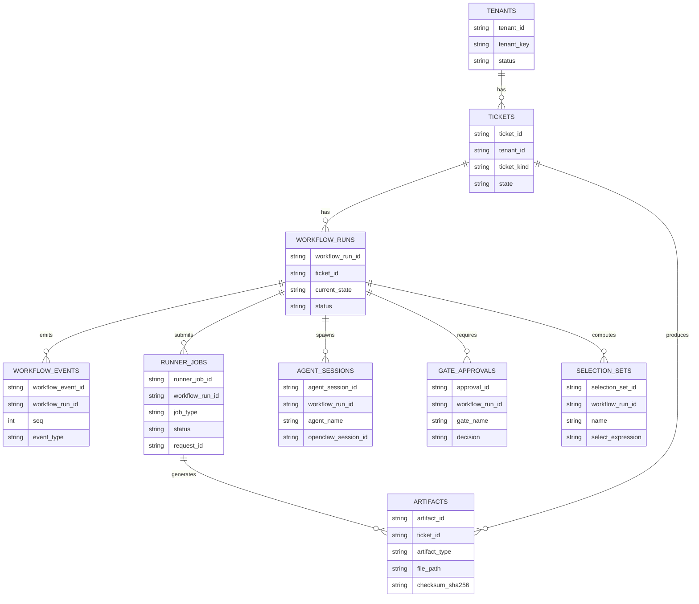

## System data model overview

This data model is designed to support an autonomous, multi-agent workflow that transforms a data engineering ticket into a GitHub pull request containing dbt models, while preserving the runner-split execution boundary and enabling high-quality observability and audit.

### Design principles

**Event-driven workflow tracking**  
The system stores workflow progress as (a) a current state on the workflow run and ticket records, and (b) an append-only event log of transitions and side effects. This makes it possible to reconstruct “what happened” even when multiple agents and execution jobs interleave.

**Artefact-first debugging**  
Every major step produces explicit artefacts (design documents, profiling reports, compile/build summaries, dbt artefacts, PR summaries). dbt itself generates JSON artefacts on invocations, including `run_results.json`, which contains timing and status information for executed nodes and is therefore a natural QA evidence base. citeturn0search2turn0search6

**Immutable job records**  
Runner job executions are recorded as immutable job rows with a stable request id, lifecycle timestamps, result payloads, and log/artefact references. This supports audit, cross-run comparison, and safe retries.

**Idempotency for side-effecting operations**  
All side-effecting operations (runner jobs, gate approvals, PR creation) require stable idempotency keys so that retries do not create duplicate branches, duplicate PRs, or repeated tenant provisioning.

**Auditability and least privilege**  
The schema supports tracking “who did what” (actor, agent, system), which matters for safety in autonomous systems and aligns with OpenClaw security guidance to treat “tools enabled” and “public exposure/missing auth” as high-risk misconfigurations requiring strict controls. citeturn0search1

**SQLite now, Postgres later**  
SQLite is used for local development. The schema is designed to be compatible with Postgres in production, particularly for JSON and concurrency requirements. Postgres provides native `json`/`jsonb` types with JSON validation and operators; SQLite can store JSON as text and (optionally) query it via JSON1/JSONB features. citeturn1search2turn1search3

## Core entities

This section defines the core entities, their purposes, key relationships, and lifecycle.

### Tenants

**Purpose**  
Represents a provisioned (or provisioning) tenant analytics environment (Snowflake objects, workspace root, dbt target/repo references).

**Key relationships**  
- 1 tenant → many tickets  
- 1 tenant → many workflows (via ticket/workflow runs)

**Lifecycle**  
`requested` → `provisioning_running` → `ready` → (`disabled` or `error`)

### Tickets

**Purpose**  
Represents a user request. Tickets are the central object displayed in the UI Kanban and drive workflow runs.

**Key relationships**  
- many tickets → 1 tenant  
- 1 ticket → many workflow runs (attempts/retries over time)  
- 1 ticket → many artefacts  
- 1 ticket → many agent sessions  
- 1 ticket → many runner jobs  

**Lifecycle**  
Matches the workflow states used by the orchestrator, including gate states (Design Review, Ready for Review).

### Workflow runs

**Purpose**  
Represents an execution instance of a workflow for a ticket (eg, “ticket-to-pr attempt #2”). Stores current state and run-level invariants such as `trace_id` and policy snapshot.

**Key relationships**  
- 1 ticket → many workflow runs  
- 1 workflow run → many workflow events  
- 1 workflow run → many runner jobs  
- 1 workflow run → many agent sessions  
- 1 workflow run → many gate approvals  

**Lifecycle**  
`running` → `succeeded|failed|cancelled`

### Workflow events

**Purpose**  
Append-only event log for observability, audit, replay, and UI activity feeds.

**Key relationships**  
- many workflow events → 1 workflow run  
- events may reference runner jobs, artefacts, sessions as correlation targets

**Lifecycle**  
Immutable (never updated), only appended.

### Artefacts

**Purpose**  
Metadata registry for files written into the workspace (design doc, profiling report, run results, PR summary, logs). Files live on the workspace volume; the DB stores pointers, checksums, size, and provenance.

dbt also generates artefact JSONs on invocations (eg `run_results.json`, `manifest.json`), which can be registered into this artefact store for reproducibility and audit. citeturn0search6turn0search2

### Runner jobs

**Purpose**  
Tracks allowlisted runner job execution (Snowflake SQL, dbt compile/build, workspace writes, git/PR actions). Supports retries, auditing, and status tracking.

Snowflake operations can optionally record query IDs (unique strings) to enable forensic linking to warehouse activity. citeturn1search1turn1search5

### Agent sessions

**Purpose**  
Tracks each agent’s run context, OpenClaw session identifiers, timing, tool calls, and token/cost summaries for debugging and UI observability. OpenClaw’s tooling model allows per-agent tool configuration and allow/deny policies, which should be reflected in recorded session metadata (policy version, tool allowlist snapshot). citeturn0search0turn0search1

### Recommended supporting entities

These are not strictly required, but materially improve determinism and queryability:

- **Gate approvals**: explicit records for human approvals (Design Review, Ready for Review) rather than encoding solely as events.
- **Selection sets**: orchestrator-computed, persisted dbt `--select` scopes used for compile/build so QA is never unconstrained; dbt supports selection syntax and graph operators (eg `+`) that can significantly expand scope, making persistence of the computed expression essential for reproducibility. citeturn0search7turn0search3

## Table schemas

Types are written with **portable intent**:

- **ID fields**: use `TEXT` (UUID string) in SQLite; `UUID` in Postgres.
- **Timestamps**: store UTC timestamps; use `TEXT` (ISO8601) in SQLite; `timestamptz` in Postgres.
- **JSON fields**: `TEXT` in SQLite (optionally queryable with JSON1); `jsonb` in Postgres. citeturn1search3turn1search2

Where useful, I list both “SQLite type” and “Postgres type”.

### tenants

**Purpose**  
Tenant registry and configuration.

**Schema**

```
tenants
-------
tenant_id                (PK)  SQLite: TEXT    Postgres: UUID
tenant_key               UNIQUE SQLite: TEXT    Postgres: TEXT             -- human-friendly slug
name                           SQLite: TEXT    Postgres: TEXT
status                         SQLite: TEXT    Postgres: TEXT             -- requested|provisioning_running|ready|disabled|error
snowflake_connection_alias      SQLite: TEXT    Postgres: TEXT
dbt_repo_url                    SQLite: TEXT    Postgres: TEXT
dbt_default_branch              SQLite: TEXT    Postgres: TEXT
workspace_root                  SQLite: TEXT    Postgres: TEXT             -- eg workspaces/tenants/<tenant_key>/
metadata_json                   SQLite: TEXT    Postgres: JSONB

created_at                      SQLite: TEXT    Postgres: TIMESTAMPTZ
updated_at                      SQLite: TEXT    Postgres: TIMESTAMPTZ
created_by                      SQLite: TEXT    Postgres: TEXT
updated_by                      SQLite: TEXT    Postgres: TEXT
```

**Indexes**
- `idx_tenants_status` on `(status)`
- `idx_tenants_tenant_key` unique on `(tenant_key)`

### tickets

**Purpose**  
Ticket lifecycle driver for both tenant provisioning and data engineering requests.

**Schema**

```
tickets
-------
ticket_id                 (PK)  SQLite: TEXT    Postgres: UUID
tenant_id                 (FK)  SQLite: TEXT    Postgres: UUID   -> tenants.tenant_id

ticket_kind                      SQLite: TEXT    Postgres: TEXT   -- TENANT_PROVISIONING|DATA_ENGINEERING
title                            SQLite: TEXT    Postgres: TEXT
description                      SQLite: TEXT    Postgres: TEXT
priority                         SQLite: TEXT    Postgres: TEXT   -- P0|P1|P2|P3
state                            SQLite: TEXT    Postgres: TEXT   -- workflow state (see below)

raw_request_json                 SQLite: TEXT    Postgres: JSONB  -- original UI payload
normalised_request_json          SQLite: TEXT    Postgres: JSONB  -- intake-normalised spec
last_error                       SQLite: TEXT    Postgres: TEXT
version                          SQLite: INTEGER Postgres: INTEGER -- optimistic concurrency

current_workflow_run_id          (FK nullable) -> workflow_runs.workflow_run_id

-- convenience external refs for UI (optional but practical)
pr_url                           SQLite: TEXT    Postgres: TEXT
pr_number                        SQLite: INTEGER Postgres: INTEGER
pr_branch                        SQLite: TEXT    Postgres: TEXT
pr_repo                          SQLite: TEXT    Postgres: TEXT   -- owner/repo

created_at                       SQLite: TEXT    Postgres: TIMESTAMPTZ
updated_at                       SQLite: TEXT    Postgres: TIMESTAMPTZ
created_by                       SQLite: TEXT    Postgres: TEXT
updated_by                       SQLite: TEXT    Postgres: TEXT
```

**Indexes**
- `idx_tickets_tenant_state_updated` on `(tenant_id, state, updated_at desc)`
- `idx_tickets_kind_state` on `(ticket_kind, state)`
- `idx_tickets_created_at` on `(created_at desc)`

### workflow_runs

**Purpose**  
Run-level tracking and current state for deterministic orchestration.

**Schema**

```
workflow_runs
-------------
workflow_run_id           (PK)  SQLite: TEXT    Postgres: UUID
ticket_id                 (FK)  SQLite: TEXT    Postgres: UUID  -> tickets.ticket_id
tenant_id                 (FK)  SQLite: TEXT    Postgres: UUID  -> tenants.tenant_id  -- denormalised for fast queries

workflow_name                   SQLite: TEXT    Postgres: TEXT   -- tenant_provisioning|ticket_to_pr
attempt                         SQLite: INTEGER Postgres: INTEGER -- 1..N per ticket/workflow_name
status                          SQLite: TEXT    Postgres: TEXT   -- running|succeeded|failed|cancelled
current_state                   SQLite: TEXT    Postgres: TEXT
state_entered_at                SQLite: TEXT    Postgres: TIMESTAMPTZ

workspace_root SQLite: TEXT Postgres: TEXT  
-- run-specific workspace root  
-- example:  
-- workspaces/tenants/<tenant_id>/tickets/<ticket_id>/runs/<workflow_run_id>/

trace_id                        SQLite: TEXT    Postgres: TEXT   -- propagated across events/jobs/sessions
orchestrator_version            SQLite: TEXT    Postgres: TEXT
policy_snapshot_json            SQLite: TEXT    Postgres: JSONB  -- tool policies, selection policy, guardrails

started_at                      SQLite: TEXT    Postgres: TIMESTAMPTZ
finished_at                     SQLite: TEXT    Postgres: TIMESTAMPTZ
started_by                      SQLite: TEXT    Postgres: TEXT   -- system/user
finished_reason                 SQLite: TEXT    Postgres: TEXT
```

**Indexes**
- `idx_workflow_runs_ticket` on `(ticket_id, attempt desc)`
- `idx_workflow_runs_state` on `(current_state, status)`
- `idx_workflow_runs_trace` on `(trace_id)`

### workflow_events

**Purpose**  
Immutable event stream for audit, replay, and UI timelines.

**Schema**

```
workflow_events
---------------
workflow_event_id         (PK)  SQLite: TEXT    Postgres: UUID
workflow_run_id           (FK)  SQLite: TEXT    Postgres: UUID -> workflow_runs.workflow_run_id
ticket_id                 (FK)  SQLite: TEXT    Postgres: UUID -> tickets.ticket_id
tenant_id                 (FK)  SQLite: TEXT    Postgres: UUID -> tenants.tenant_id

seq                             SQLite: INTEGER Postgres: BIGINT  -- monotonic per workflow_run_id
event_time                      SQLite: TEXT    Postgres: TIMESTAMPTZ

event_type                      SQLite: TEXT    Postgres: TEXT    -- eg state_transition|job_submitted|artifact_registered|gate_decision|error
from_state                      SQLite: TEXT    Postgres: TEXT
to_state                        SQLite: TEXT    Postgres: TEXT

actor_type                      SQLite: TEXT    Postgres: TEXT    -- user|agent|system
actor_id                        SQLite: TEXT    Postgres: TEXT    -- user_id or agent_name
correlation_id                  SQLite: TEXT    Postgres: TEXT    -- eg runner_job_id or agent_session_id
trace_id                        SQLite: TEXT    Postgres: TEXT

severity                        SQLite: TEXT    Postgres: TEXT    -- INFO|WARN|ERROR
message                         SQLite: TEXT    Postgres: TEXT
payload_json                    SQLite: TEXT    Postgres: JSONB
```

**Indexes**
- `idx_workflow_events_run_seq` on `(workflow_run_id, seq)`
- `idx_workflow_events_ticket_time` on `(ticket_id, event_time desc)`
- `idx_workflow_events_type_time` on `(event_type, event_time desc)`
- `idx_workflow_events_trace` on `(trace_id)`

### artifacts

**Purpose**  
Metadata registry for workspace files and externally meaningful outputs (PR summary, design docs, dbt artefacts).

**Schema**

```
artifacts
---------
artifact_id               (PK)  SQLite: TEXT    Postgres: UUID
ticket_id                 (FK)  SQLite: TEXT    Postgres: UUID -> tickets.ticket_id
workflow_run_id           (FK)  SQLite: TEXT    Postgres: UUID -> workflow_runs.workflow_run_id
tenant_id                 (FK)  SQLite: TEXT    Postgres: UUID -> tenants.tenant_id

agent_name                      SQLite: TEXT    Postgres: TEXT   -- Intake|Design|Profiler|Builder|QA|PR|TenantProvisioning|Orchestrator

artifact_type                   SQLite: TEXT    Postgres: TEXT   -- design_md|profiling_md|profile_report|compile_summary|run_results|qa_report|pr_summary|log

artifact_role SQLite: TEXT Postgres: TEXT  
-- UI friendly category  
-- examples:  
-- design_doc  
-- profiling_report  
-- compile_summary  
-- qa_evidence  
-- dbt_artifact  
-- pr_summary  
-- log


format                          SQLite: TEXT    Postgres: TEXT   -- md|json|yml|sql|text
file_path                       SQLite: TEXT    Postgres: TEXT   -- relative to workspace root
checksum_sha256                 SQLite: TEXT    Postgres: TEXT
byte_size                       SQLite: INTEGER Postgres: BIGINT
content_type                    SQLite: TEXT    Postgres: TEXT

source_runner_job_id            (FK nullable) -> runner_jobs.runner_job_id
created_at                      SQLite: TEXT    Postgres: TIMESTAMPTZ
created_by                      SQLite: TEXT    Postgres: TEXT   -- agent_name or user_id
metadata_json                   SQLite: TEXT    Postgres: JSONB
```

**Indexes**
- `idx_artifacts_ticket_type_time` on `(ticket_id, artifact_type, created_at desc)`
- `idx_artifacts_path` on `(tenant_id, file_path)`
- `idx_artifacts_checksum` on `(checksum_sha256)`

**Why we added Artifact role:**
Artifact role provides a UI-friendly classification for artifacts. 
While artifact_type represents the technical artifact category,
artifact_role groups artifacts into logical workflow stages
(Design, Profiling, Build, QA, PR).

This allows the UI to render ticket detail views deterministically
without inferring categories from filenames.


### runner_jobs

**Purpose**  
Immutable execution audit and status tracking for runner Job API calls.

**Schema**

```
runner_jobs
-----------
runner_job_id            (PK)  SQLite: TEXT    Postgres: UUID
workflow_run_id          (FK)  SQLite: TEXT    Postgres: UUID -> workflow_runs.workflow_run_id
ticket_id                (FK)  SQLite: TEXT    Postgres: UUID -> tickets.ticket_id
tenant_id                (FK)  SQLite: TEXT    Postgres: UUID -> tenants.tenant_id

request_id               UNIQUE SQLite: TEXT    Postgres: UUID   -- idempotency key from api (must be unique)
parent_job_id            (FK nullable) -> runner_jobs.runner_job_id  -- for retries

job_type                       SQLite: TEXT    Postgres: TEXT   -- allowlisted enum: snowflake_sql|dbt_compile|dbt_build|workspace_write_files|git_commit_push|gh_create_pr|...
status                         SQLite: TEXT    Postgres: TEXT   -- queued|running|succeeded|failed|timed_out|cancelled

requested_by_actor_type        SQLite: TEXT    Postgres: TEXT   -- agent|system
requested_by_actor_id          SQLite: TEXT    Postgres: TEXT   -- agent_name
requested_at                   SQLite: TEXT    Postgres: TIMESTAMPTZ
started_at                     SQLite: TEXT    Postgres: TIMESTAMPTZ
finished_at                    SQLite: TEXT    Postgres: TIMESTAMPTZ

timeout_seconds                SQLite: INTEGER Postgres: INTEGER
attempt                        SQLite: INTEGER Postgres: INTEGER

request_payload_json           SQLite: TEXT    Postgres: JSONB   -- MUST NOT contain secrets
result_payload_json            SQLite: TEXT    Postgres: JSONB
exit_code                      SQLite: INTEGER Postgres: INTEGER
error_message                  SQLite: TEXT    Postgres: TEXT

log_path                       SQLite: TEXT    Postgres: TEXT    -- relative path under workspace logs/
trace_id                       SQLite: TEXT    Postgres: TEXT
span_id                        SQLite: TEXT    Postgres: TEXT

-- optional external forensic refs
snowflake_query_id             SQLite: TEXT    Postgres: TEXT
github_pr_url                  SQLite: TEXT    Postgres: TEXT
github_pr_number               SQLite: INTEGER Postgres: INTEGER
```

**Notes**
- Snowflake query IDs are unique identifiers (strings) for executed queries; persisting them improves traceability of warehouse actions. citeturn1search1turn1search5
- GitHub pull requests are represented in GitHub’s REST API under pull request endpoints and share behaviours with issue endpoints for some actions; storing PR URL/number supports UI integration. citeturn1search0turn1search4

**Indexes**
- `idx_runner_jobs_ticket_time` on `(ticket_id, requested_at desc)`
- `idx_runner_jobs_status` on `(status, requested_at desc)`
- `idx_runner_jobs_type_status` on `(job_type, status)`
- `idx_runner_jobs_request_id` unique on `(request_id)`
- `idx_runner_jobs_trace` on `(trace_id)`

### agent_sessions

**Purpose**  
Tracks each agent’s run, its OpenClaw session pointers, and run outcomes.

**Schema**

```
agent_sessions
--------------
agent_session_id          (PK)  SQLite: TEXT    Postgres: UUID
workflow_run_id           (FK)  SQLite: TEXT    Postgres: UUID -> workflow_runs.workflow_run_id
ticket_id                 (FK)  SQLite: TEXT    Postgres: UUID -> tickets.ticket_id
tenant_id                 (FK)  SQLite: TEXT    Postgres: UUID -> tenants.tenant_id

agent_name                      SQLite: TEXT    Postgres: TEXT   -- Intake|Design|Profiler|Builder|QA|PR|TenantProvisioning
openclaw_session_id             SQLite: TEXT    Postgres: TEXT
status                          SQLite: TEXT    Postgres: TEXT   -- planned|running|succeeded|failed|cancelled|timed_out

started_at                      SQLite: TEXT    Postgres: TIMESTAMPTZ
finished_at                     SQLite: TEXT    Postgres: TIMESTAMPTZ

tool_allowlist_json             SQLite: TEXT    Postgres: JSONB   -- policy snapshot applied to this agent
tool_calls_summary_json         SQLite: TEXT    Postgres: JSONB   -- tool names + counts + key refs
token_usage_json                SQLite: TEXT    Postgres: JSONB   -- prompt/completion tokens, etc
cost_usd                        SQLite: REAL    Postgres: NUMERIC(12,4)

trace_id                        SQLite: TEXT    Postgres: TEXT
error_message                   SQLite: TEXT    Postgres: TEXT
```

**Indexes**
- `idx_agent_sessions_ticket_agent_time` on `(ticket_id, agent_name, started_at desc)`
- `idx_agent_sessions_status` on `(status, started_at desc)`
- `idx_agent_sessions_openclaw` on `(openclaw_session_id)`

### gate_approvals

**Purpose**  
Records human approvals at workflow gate states (Design Review, Ready for Review). Storing this explicitly avoids ambiguity when reconstructing decisions.

**Schema**

```
gate_approvals
--------------
approval_id               (PK)  SQLite: TEXT    Postgres: UUID
workflow_run_id           (FK)  SQLite: TEXT    Postgres: UUID -> workflow_runs.workflow_run_id
ticket_id                 (FK)  SQLite: TEXT    Postgres: UUID -> tickets.ticket_id
tenant_id                 (FK)  SQLite: TEXT    Postgres: UUID -> tenants.tenant_id

gate_name                       SQLite: TEXT    Postgres: TEXT   -- DESIGN_REVIEW|READY_FOR_REVIEW
decision                        SQLite: TEXT    Postgres: TEXT   -- approved|rejected
actor_id                        SQLite: TEXT    Postgres: TEXT   -- user id
decided_at                      SQLite: TEXT    Postgres: TIMESTAMPTZ
comment                         SQLite: TEXT    Postgres: TEXT
idempotency_key           UNIQUE SQLite: TEXT    Postgres: TEXT   -- eg <workflow_run_id>:<gate_name>
evidence_artifact_id            SQLite: TEXT    Postgres: UUID    -- optional pointer to design.md or qa_report.md
```

**Indexes**
- `idx_gate_approvals_ticket_gate` on `(ticket_id, gate_name)`
- `idx_gate_approvals_workflow` on `(workflow_run_id, gate_name)`

### selection_sets

**Purpose**  
Persist orchestrator-defined dbt selection scopes for compile/build runs so QA is reproducible and constrained. dbt selection syntax and graph operators can expand selection significantly (eg `+` includes ancestors/descendants), so storing the computed expression is critical. citeturn0search7turn0search3

**Schema**

```
selection_sets
--------------
selection_set_id          (PK)  SQLite: TEXT    Postgres: UUID
workflow_run_id           (FK)  SQLite: TEXT    Postgres: UUID -> workflow_runs.workflow_run_id
ticket_id                 (FK)  SQLite: TEXT    Postgres: UUID -> tickets.ticket_id
tenant_id                 (FK)  SQLite: TEXT    Postgres: UUID -> tenants.tenant_id

name                           SQLite: TEXT    Postgres: TEXT    -- compile|build|smoke
select_expression              SQLite: TEXT    Postgres: TEXT    -- dbt --select string
exclude_expression             SQLite: TEXT    Postgres: TEXT    -- optional
policy                         SQLite: TEXT    Postgres: TEXT    -- changed_plus_downstream|tag_based|path_based
computed_by                    SQLite: TEXT    Postgres: TEXT    -- orchestrator version
derived_from_json              SQLite: TEXT    Postgres: JSONB   -- changed files, design hash, etc

created_at                     SQLite: TEXT    Postgres: TIMESTAMPTZ
```

**Indexes**
- `idx_selection_sets_ticket_name` on `(ticket_id, name, created_at desc)`
- `idx_selection_sets_run` on `(workflow_run_id, name)`

## Workflow state machine data model

### Where state lives

State is stored in two places:

- **tickets.state**: the current state for UI (Kanban columns, filtering).
- **workflow_runs.current_state**: the current state for that specific run/attempt.

This allows multiple historical runs per ticket while still showing the most recent state at the ticket level.

### How transitions are recorded

Every transition is recorded as a **workflow_event** row:

- `event_type = state_transition`
- `from_state`, `to_state`
- `actor_type` and `actor_id`
- `payload_json` includes evidence references (artefact IDs, job IDs, approval ID)

### Replay capability

Replays are supported by event sourcing semantics:

- `workflow_events` is append-only and ordered per run by `(workflow_run_id, seq)`.
- To replay: start from the run’s initial state and apply state_transition events in order, verifying that each transition is valid.

Replay is essential for autonomous multi-agent systems because it enables consistent post-mortems and deterministic behaviour under retries.

### Retry logic and failure handling

Retries should be modelled explicitly:

- A new **runner job** row is created for a retry (`parent_job_id` points to the original job, `attempt` increments).
- A new **agent session** row may be created if an agent is rerun.
- Workflow state returns to the appropriate earlier state (eg `QA` → `BUILD`) and is recorded as a `state_transition` event.

Failures are handled by:

- setting `workflow_runs.status = failed`
- setting `tickets.state = FAILED`
- appending a `workflow_event` with `event_type = error` and references to job logs and artefacts.

### Example transitions

(These are illustrative; they are stored as rows in `workflow_events`.)

- `TICKET_INTAKE` → `DESIGN_REVIEW` (Intake artefact published)
- `DESIGN_REVIEW` → `PROFILING` (Design gate approved; gate_approval row created)
- `QA` → `READY_FOR_REVIEW` (dbt build succeeded; run_results registered)
- `READY_FOR_REVIEW` → `PR_CREATION` (Human approval gate)
- `PR_CREATION` → `DONE` (PR URL recorded)

## Artefact storage model

### Separation of concerns: metadata vs files

- **Files live on the workspace volume** (eg `workspaces/tenants/<tenant>/tickets/<ticket>/...`).
- **Metadata lives in the database** (`artifacts` table).

This separation is deliberately chosen because:

- Workspace files are large and varied (SQL, YAML, JSON artefacts, logs).
- Metadata needs to be indexed and queryable for UI and audit.
- Database records can be backed up and queried without coupling to filesystem operations.

### Required artefacts and recommended types

The system should treat these as first-class artefact types (examples):

- `design.md` (Design Agent)
- profiling report JSON + summary MD (Profiler Agent)
- compile summary JSON (Builder Agent)
- `run_results.json` (QA Agent; produced by dbt invocation) citeturn0search2
- QA report MD (QA Agent)
- PR summary MD (PR Agent)
- dbt artefacts (manifest/catalog/etc) if docs are generated (optional) citeturn0search6

### What metadata to store

Minimum metadata for reliable debugging and reproducibility:

- `file_path` (relative)
- `checksum_sha256`
- `byte_size`
- `created_at`, `created_by` (agent/job)
- `source_runner_job_id` to connect artefacts to execution evidence
- `metadata_json` for structured details (eg selection set used, model list, test list)

## Runner job tracking and agent session tracking

### Runner job tracking

Runner job rows are the backbone of execution observability:

- job lifecycle timestamps enable duration analysis and timeouts
- request/result payloads enable replay and debugging
- log paths and artefact references enable UI display and troubleshooting
- `request_id` uniqueness enforces idempotent job submission

For GitHub integration, PR creation is performed via runner (git + GitHub operations). GitHub documents pull request endpoints under its REST API and clarifies some PR actions are managed via issue endpoints, which is relevant if you add labels/assignees in future. citeturn1search0turn1search4

For Snowflake, storing optional `snowflake_query_id` supports linking runner actions to underlying warehouse query history. Snowflake documents query IDs as unique strings and provides functions (eg `LAST_QUERY_ID`) that return query IDs. citeturn1search1turn1search5

### Agent session tracking

Agent sessions support:

- pinpointing which agent produced which artefacts
- correlating tool calls to runner jobs
- cost/usage tracking for resource management
- debugging “why did the agent decide that?” via stored artefacts and summaries

OpenClaw’s tool policy model supports per-agent tool configuration; storing `tool_allowlist_json` per session helps demonstrate and audit least-privilege boundaries and supports “why tool call X was blocked” diagnostics. citeturn0search0turn0search1

## Relationships diagram, lifecycle walkthrough, indexing, and migrations

### Relationships diagram



ASCII fallback:

```text
tenants 1---* tickets 1---* workflow_runs 1---* workflow_events
                      \               \---* runner_jobs ---* artifacts
                       \               \---* agent_sessions
                        \---* artifacts
workflow_runs ---* gate_approvals
workflow_runs ---* selection_sets
```

### Example lifecycle walkthrough

Ticket: “Create fct_daily_orders from RAW.ORDERS and RAW.CUSTOMERS; add tests; open PR.”

1) **Ticket created**
- Insert `tickets` row (`state = TICKET_INTAKE`, `ticket_kind = DATA_ENGINEERING`)
- Insert `workflow_runs` row (`status = running`, `current_state = TICKET_INTAKE`, `attempt = 1`, `trace_id`)
- Append `workflow_events`: `event_type=state_transition`, `to_state=TICKET_INTAKE`

2) **Intake agent session starts**
- Insert `agent_sessions` row (agent_name=Intake, status=running, openclaw_session_id)
- Append `workflow_events`: `agent_session_started`

3) **Intake produces artefact**
- Insert `artifacts` row: `docs/intake_summary.md`
- Update `agent_sessions.status = succeeded`
- Append `workflow_events`: `artifact_registered`
- Orchestrator transitions: update `workflow_runs.current_state = DESIGN_REVIEW`, update `tickets.state = DESIGN_REVIEW`
- Append `workflow_events`: `state_transition` (TICKET_INTAKE → DESIGN_REVIEW)

4) **Design gate approved**
- Insert `gate_approvals` row (gate_name=DESIGN_REVIEW, decision=approved)
- Append `workflow_events`: `gate_decision`
- Transition to `PROFILING`

5) **Profiler executes Snowflake SQL**
- Insert `agent_sessions` row for Profiler
- Insert `runner_jobs` row with `job_type=snowflake_sql`, `request_id` unique, status=queued
- Append `workflow_events`: `job_submitted`
- Runner updates status to running then succeeded; orchestrator records result:
  - update `runner_jobs.status`, timestamps, `snowflake_query_id` if available
- Insert `artifacts` rows (profile_report.json, profiling.md) referencing `source_runner_job_id`
- Append `workflow_events`: `artifact_registered`
- Transition to `BUILD`

6) **Builder writes dbt files and compiles**
- Insert Builder session
- Submit runner job `workspace_write_files` (bounded to `dbt_changes/`)
- Submit runner job `dbt_compile` with orchestrator-computed selection set:
  - insert `selection_sets` row (name=compile, select_expression=…)
- Register compile_summary artefact
- Transition to `QA`

7) **QA builds**
- Insert QA session
- Submit runner job `dbt_build` with orchestrator-computed selection set:
  - insert `selection_sets` row (name=build)
- Register `outputs/run_results.json` and `docs/qa_report.md` artefacts
- If succeeded, transition to `READY_FOR_REVIEW`; else transition back to `BUILD` and append error events

8) **Ready for Review gate approved**
- Insert `gate_approvals` (gate_name=READY_FOR_REVIEW)
- Transition to `PR_CREATION`

9) **PR created**
- Insert PR session
- Submit runner jobs: `git_commit_push`, `gh_create_pr`
- Update `tickets.pr_url/pr_number/pr_branch/pr_repo`
- Register `docs/pr_summary.md` artefact
- Transition to `DONE` and set `workflow_runs.status = succeeded`

### Indexing strategy

**Ticket queries (Kanban + search)**
- `(tenant_id, state, updated_at desc)`
- `(ticket_kind, state)`
- `(created_at desc)` for latest-first views

**Artefact lookup**
- `(ticket_id, artifact_type, created_at desc)` to populate ticket detail panels quickly
- `(checksum_sha256)` to dedupe and to validate integrity

**Workflow state queries**
- `(current_state, status)` to list all “stuck” runs
- `(ticket_id, attempt desc)` to quickly fetch most recent run per ticket

**Runner job observability**
- `(ticket_id, requested_at desc)` to show per-ticket execution timeline
- `(status, requested_at desc)` for global “what’s currently running”
- `(request_id)` unique for idempotency enforcement
- `(trace_id)` for correlation across events/jobs/sessions

**Agent session inspection**
- `(ticket_id, agent_name, started_at desc)`
- `(openclaw_session_id)` for direct lookup from gateway references

### Migration strategy

**Versioned migrations from day one**
- Use a migration tool (eg Alembic in Python) with a linear migration history.
- Store a schema version table (`alembic_version` or equivalent).

**Backwards compatibility**
- Favour additive migrations: add nullable columns; backfill asynchronously.
- Avoid destructive changes in early iterations (especially for event logs).

**Schema change safety**
- Treat `workflow_events`, `runner_jobs`, and `artifacts` as audit tables: prefer append-only patterns and avoid updates where feasible.
- When introducing new enum values (states, job types), use text + check constraints (portable) or versioned reference tables; avoid hard Postgres enums if you need cross-engine portability.

**SQLite to Postgres transition**
- Keep IDs and timestamps compatible (UUID as text in SQLite; UUID in Postgres).
- Keep JSON fields as text in SQLite and JSONB in Postgres; Postgres validates JSON values and provides JSON operators, while SQLite can query JSON via JSON1/JSONB facilities if needed. citeturn1search2turn1search3