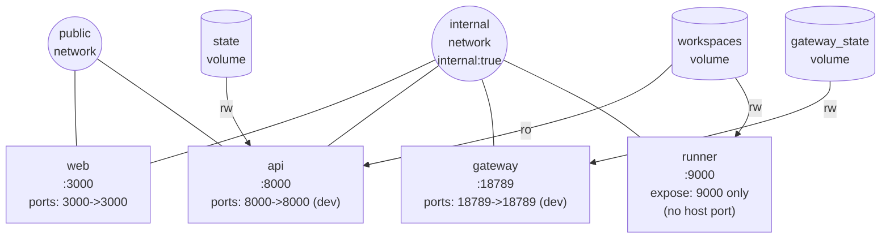
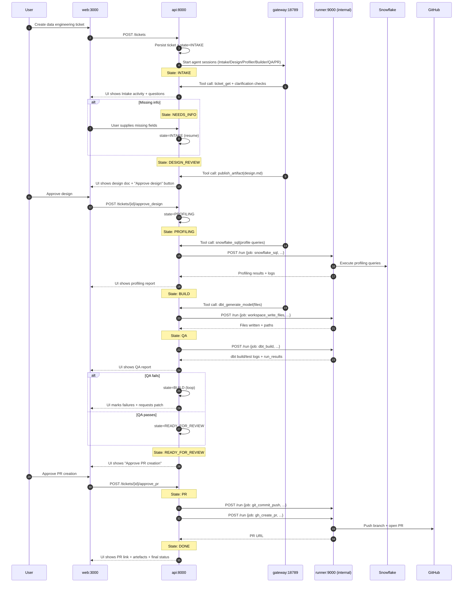
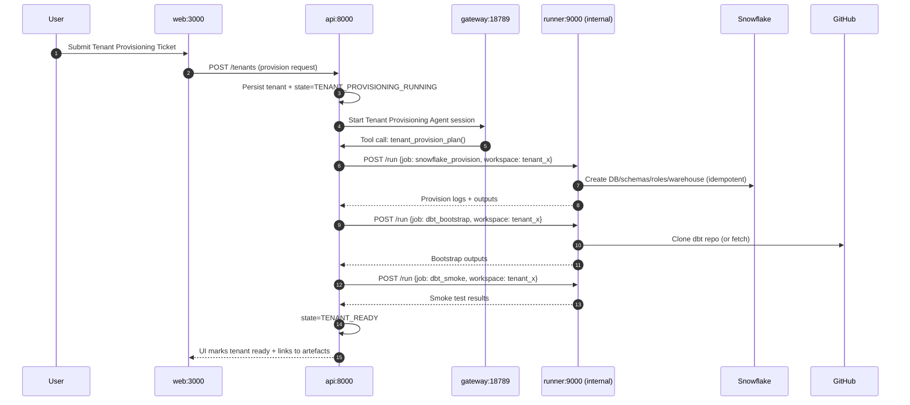
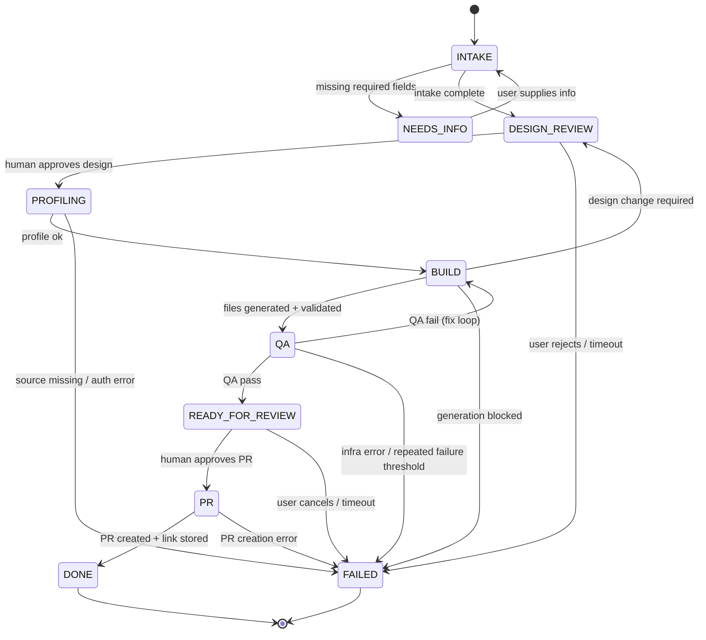
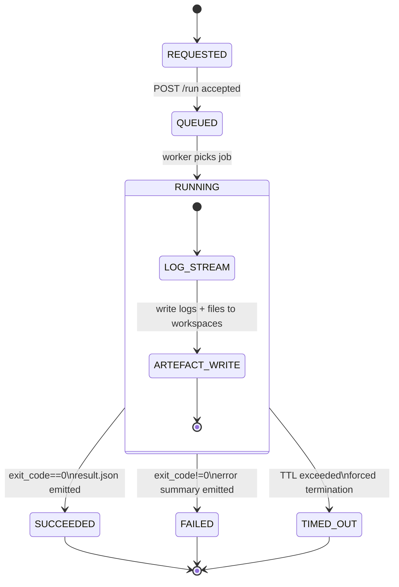
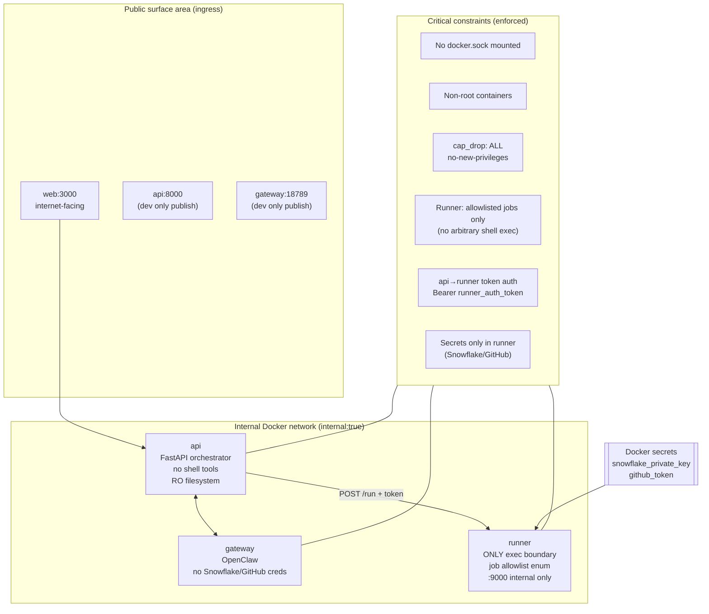

## Assumptions / small fixes

  

- A `runner_auth_token` is defined as a **Docker secret** (or equivalent) and mounted into **both** `api` and `runner` so `api → runner` calls can use `Authorization: Bearer …` without placing tokens in plain environment variables.

- `api:8000` and `gateway:18789` are **published to the host only in dev**; in staging/production they remain internal behind a reverse proxy (or not published at all).

- `runner:9000` is **never published** to the host; it is internal-only (`expose: 9000`) on the `internal` Docker network.

- The `workspaces` volume is mounted **read-write** in `runner` and **read-only** in `api`; `web` reads artefacts via `api` (not via direct volume mounts).

- `gateway` has **no Snowflake/GitHub credentials**; all secrets needed for `dbt/snow/git/gh` live only in `runner`.

- “Windsor API” is treated as an **external upstream data/API** (source or enrichment) accessed only via `runner` jobs (no direct access from `web`, `api`, or `gateway`).

  

## Diagram pack

  

**Diagram 1 — C4-style container diagram (system context + container view, with trust boundaries)**

  

```mermaid

flowchart LR

  U([User])

  

  subgraph PUB["Public surface area"]

    WEB["web\nNext.js\n:3000"]

    APIDEV["api\nFastAPI orchestrator\n:8000 (dev publish)"]

    GWDEV["gateway\nOpenClaw Gateway\n:18789 (dev publish)"]

  end

  

  subgraph INT["Docker network: internal (internal:true)"]

    API["api\nFastAPI orchestrator\n(no dbt/snow/git/gh)\n:8000"]

    GW["gateway\nOpenClaw Gateway\nagent sessions\n:18789"]

    subgraph EXEC["Execution trust boundary\nONLY runner executes dbt/snow/git/gh"]

      RUN["runner\nRunner Job API\n:9000 (internal only)\nexec: dbt + snow + git + gh"]

    end

    STATE[("state\nvolume")]

    WS[("workspaces\nvolume")]

    GWS[("gateway_state\nvolume")]

    SECRETS[["Docker secrets\nsnowflake_private_key\ngithub_token\nrunner_auth_token"]]

  end

  

  SNOW[(Snowflake)]

  GIT[(GitHub)]

  WIN[(Windsor API)]

  

  U --> WEB

  WEB --> API

  

  API <--> GW

  

  GW -->|tool invoke\n(agent → gateway → api)| API

  API -->|POST /run\n(job allowlist)| RUN

  

  RUN --> SNOW

  RUN --> GIT

  RUN --> WIN

  

  API --- STATE

  GW --- GWS

  RUN --- WS

  API --- WS

  

  SECRETS --> RUN

  SECRETS --> API

```

  

ASCII fallback:

  

```text

User

  |

  v

web:3000  (public)

  |

  v

api:8000 (dev publish)  <-->  gateway:18789 (dev publish)

  |

  v

runner:9000 (internal only)  <-- ONLY place with dbt/snow/git/gh + secrets

  |        \

  v         v

Snowflake   GitHub   (also Windsor API)

```

  

Explanation: This is the top-level context plus container view showing the explicit trust boundary: **only `runner` executes dbt/snow/git/gh**, and agents must go `agent → gateway → api tool → runner`.

  

---

  

**Diagram 2 — Docker Compose network & volume diagram (networks, mounts, and port exposure)**

  



  

ASCII fallback:
 

```text

Networks:

  public:   web, api (dev)

  internal: web, api, gateway, runner (internal:true)

  

Volumes:

  state        -> api (rw)

  workspaces   -> runner (rw), api (ro)

  gateway_state-> gateway (rw)

  

Ports:

  web:3000 published

  api:8000 published (dev)

  gateway:18789 published (dev)

  runner:9000 NOT published (internal expose only)

```

  

Explanation: This diagram explicitly encodes what attaches where, and which volumes are mounted **ro vs rw** to support the runner split.

  

---

  

**Diagram 3 — Tool invocation chain (agent → gateway → api tool → runner job API → artefacts → UI)**

  

```mermaid

flowchart LR

  AG["Agent session\n(in gateway)"]

  GW["gateway\n:18789"]

  API["api tool endpoint\n:8000"]

  RUN["runner job API\n:9000\ninternal only"]

  WS[("workspaces\nvolume")]

  UI["web UI\n:3000"]

  EXT["External systems\nSnowflake/GitHub/Windsor"]

  

  AG -->|1) reason + tool call| GW

  GW -->|2) tool invoke| API

  API -->|3) POST /run (allowlisted job)| RUN

  RUN -->|4) execute dbt/snow/git/gh| EXT

  RUN -->|5) write logs + artefacts| WS

  RUN -->|6) job result payload| API

  API -->|7) read artefacts (ro)| WS

  API -->|8) WS/SSE events + status| UI

```

  

ASCII fallback:

  

```text

Agent (gateway session)

   |

   v

gateway -> api(tool endpoint) -> runner(/run job) -> Snowflake/GitHub/Windsor

                                 |

                                 v

                             workspaces (logs/artefacts)

                                 |

                                 v

api reads (ro) -> web UI updates

```

  

Explanation: It makes the “no direct runner access” rule concrete: **agents never call runner**; only `api` calls `runner`.

  

---

  

**Diagram 4 — Primary sequence diagram: Ticket-to-PR workflow (with approval gates and states)**

  



  

ASCII fallback:

  

```text

User -> web -> api (store ticket, INTAKE)

api -> gateway (start agents)

gateway -> api (tool calls)

api -> runner (snowflake_sql, write files, dbt_build)

runner -> Snowflake (profile/validate)

runner -> GitHub (push + PR)

Human approvals at:

  - Design Review

  - Ready for Review

DONE with PR link in UI

```

  

Explanation: This is the core lifecycle you demo: state progression, human gates, execution via runner jobs, and PR creation.

  

---

  

**Diagram 5 — Tenant provisioning sequence diagram (ticket → plan → provision → bootstrap → tenant ready)**

  



  

ASCII fallback:

  

```text

User -> web -> api (tenant ticket)

api -> gateway (tenant agent plan)

api -> runner: snowflake_provision -> Snowflake

api -> runner: dbt_bootstrap (repo) -> GitHub

api -> runner: dbt_smoke

api -> web: tenant READY

```

  

Explanation: Tenant provisioning is treated as a first-class workflow with runner jobs for Snowflake setup and dbt bootstrapping.

  

---

  

**Diagram 6 — Workflow state machine (ticket lifecycle with loops and terminal states DONE/FAILED)**

  



  

ASCII fallback:

  

```text

INTAKE -> NEEDS_INFO -> INTAKE

INTAKE -> DESIGN_REVIEW -(approve)-> PROFILING -> BUILD -> QA

QA fail -> BUILD (loop)

QA pass -> READY_FOR_REVIEW -(approve)-> PR -> DONE

Any stage can go to FAILED (terminal)

```

  

Explanation: This keeps state transitions explicit and implementable, including the “QA fails → back to BUILD” loop and terminal `DONE` / `FAILED`.

  

---

  

**Diagram 7 — Runner job lifecycle (request → queued → running → succeeded/failed, logs/artefacts/timeouts)**

  



  

ASCII fallback:

  

```text

POST /run -> REQUESTED -> QUEUED -> RUNNING

RUNNING emits:

  - streaming logs

  - artefacts into workspaces

Ends as:

  - SUCCEEDED (exit 0)

  - FAILED (exit !=0)

  - TIMED_OUT (TTL)

```

  

Explanation: This defines the operational contract `api` relies on: predictable statuses, structured outputs, and enforced timeouts.

  

---

  

**Diagram 8 — Threat boundary / security diagram (public surface, constraints, secrets locality)**

  



  

ASCII fallback:

  

```text

PUBLIC:

  web:3000

  api:8000 (dev only)

  gateway:18789 (dev only)

  

INTERNAL (internal:true):

  api <-> gateway

  api -> runner:9000 (token auth)

  runner holds secrets + executes dbt/snow/git/gh only

  

Controls:

  no docker.sock

  non-root, read-only FS, cap_drop ALL

  runner allowlisted job enum (no arbitrary exec)

```

  

Explanation: This diagram highlights the security posture and the single executable choke point: the `runner` job API.

  

---

  

**Diagram 9 — Artefact and workspace flow (where files live; how api reads them)**

  

```mermaid

flowchart LR

  RUN["runner\nwrites artefacts (rw)"]

  API["api\nreads artefacts (ro)\nregisters metadata in state"]

  WEB["web\nrenders artefacts via api"]

  WS[("workspaces volume")]

  ST[("state volume")]

  

  subgraph PATHS["Typical workspace paths"]

    T["workspaces/tenants/<tenant>/"]

    TK["workspaces/tenants/<tenant>/tickets/<ticket>/"]

    DOCS["docs/\n(intake/design/profiling/qa/pr_summary)"]

    DBT["dbt_changes/\n(models + tests)"]

    LOGS["logs/\n(dbt/snow/git/gh)"]

    OUT["outputs/\n(run_results, profile json)"]

  end

  

  RUN -->|write| WS

  API -->|read (ro)| WS

  API -->|write| ST

  WEB -->|GET /tickets/{id}/artefacts| API

  

  WS --- T

  T --- TK

  TK --- DOCS

  TK --- DBT

  TK --- LOGS

  TK --- OUT

```

  

ASCII fallback:

  

```text

runner (rw) -> workspaces/

api (ro) reads workspaces/ + stores metadata in state/

web asks api for artefact list + renders:

  

workspaces/tenants/<tenant>/tickets/<ticket>/

  docs/      design.md, profiling.md, qa_report.md

  dbt_changes/models/ + tests/schema.yml

  logs/      dbt_build.log, snowflake_sql.log, git.log

  outputs/   run_results.json, profile_report.json

```

  

Explanation: This makes the “artefacts live in `workspaces`” pattern concrete and ties it to the runner split (runner writes, api reads).

  

---

  

**Diagram 10 — Observability and trace propagation (trace_id across web/api/gateway/runner)**

  

```mermaid

flowchart LR

  WEB["web:3000\nUI actions\n(trace_id generated)"]

  API["api:8000\nworkflow spans\n(state transitions)"]

  GW["gateway:18789\nagent spans\n(session/tool calls)"]

  RUN["runner:9000\njob spans\n(dbt/snow/git/gh)"]

  WS[("workspaces\nlogs + artefacts")]

  OBS[(External observability backend\n(optional)\nOTel/trace store)]

  

  WEB -->|trace_id + ticket_id| API

  API <--> |trace_id| GW

  API -->|trace_id + job_id| RUN

  RUN -->|logs include trace_id| WS

  

  API -.->|export spans (optional)| OBS

  GW  -.->|export spans (optional)| OBS

  RUN -.->|export spans (optional)| OBS

```

  

ASCII fallback:

  

```text

web generates trace_id per action/ticket

  -> api uses trace_id for workflow spans + logs

     <-> gateway uses same trace_id for agent/tool spans

     -> runner gets trace_id with each job; writes logs/artefacts tagged with trace_id

(optional) export spans to external trace backend

```

  

Explanation: This diagram keeps the core service set unchanged while showing how to correlate UI activity, agent actions, and runner execution with a single trace identifier.

  

## Legend and naming conventions

  

- **Service names are exact**: `web`, `api`, `gateway`, `runner`.

- Ports are shown exactly as required: `web 3000`, `api 8000 (dev publish)`, `gateway 18789`, `runner 9000 (internal only)`.

- Networks are exactly `public` and `internal (internal:true)`.

- Volumes are exactly `state`, `workspaces`, `gateway_state`.

- “Secrets live in runner” means Snowflake/GitHub credentials are mounted only into `runner` as Docker secrets; `gateway` never receives them; `api` does not execute shell tools.

  

## Consistency checks against the handbook constraints

  

- No additional internal services were introduced; optional observability is depicted only as an external backend.

- No service was renamed; diagrams consistently use `web`, `api`, `gateway`, `runner`.

- Runner is consistently shown as the **only execution boundary** for dbt/snow/git/gh, and it is never exposed via a host port.

- The agent/tool chain is consistently shown as **agent → gateway → api tool → runner job API**, with no direct agent-to-runner access.

- Networks, volumes, and ro/rw mount intent are consistent with the runner-split security model and a Docker-first deployment.